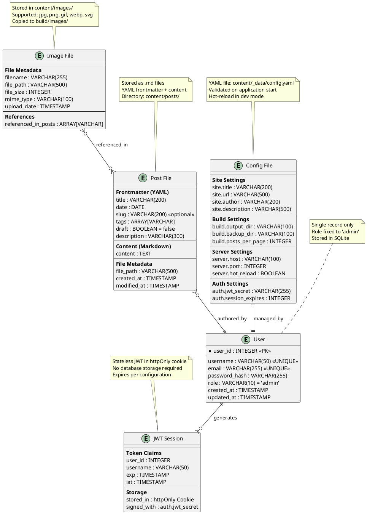

# Task Briefing Package

This package contains all necessary information and strategic guidance for the Coder Agent.

---

## 1. Current Task Details

This is the full specification of the task you must complete.

```json
{
  "task_id": "I2.T4",
  "iteration_id": "I2",
  "iteration_goal": "Implement authentication system with JWT tokens, user management, and core data models for posts and images",
  "description": "Create Post data model for markdown file handling with YAML frontmatter parsing, validation, and filesystem operations. Implement draft/published status management.",
  "agent_type_hint": "BackendAgent",
  "inputs": "Post model specification, markdown processing requirements, file system storage strategy",
  "target_files": ["microblog/content/post_service.py", "microblog/content/validators.py"],
  "input_files": ["microblog/server/config.py", "docs/diagrams/database_erd.puml"],
  "deliverables": "Post service with CRUD operations, frontmatter validation, markdown file handling, draft/publish workflow",
  "acceptance_criteria": "Posts save/load from markdown files correctly, YAML frontmatter parses properly, validation catches invalid data, draft/publish status works",
  "dependencies": ["I1.T4"],
  "parallelizable": true,
  "done": false
}
```

---

## 2. Architectural & Planning Context

The following are the relevant sections from the architecture and plan documents, which I found by analyzing the task description.

### Context: key-entities (from 03_System_Structure_and_Data.md)

```markdown
**Key Entities:**

1. **User**: Single admin user with authentication credentials (stored in SQLite)
2. **Post**: Blog posts with metadata and content (stored as markdown files with YAML frontmatter)
3. **Image**: Media files referenced in posts (stored in filesystem with metadata tracking)
4. **Configuration**: System settings and blog metadata (stored as YAML configuration file)
5. **Session**: Authentication sessions (stateless JWT tokens, no persistent storage)
```

### Context: data-model-diagram (from 03_System_Structure_and_Data.md)

```markdown
**Diagram (PlantUML - ERD):**

```

### Context: data-storage-strategy (from 03_System_Structure_and_Data.md)

```markdown
**Data Storage Strategy:**

**SQLite Database (microblog.db):**
- Stores single user authentication record
- Lightweight, serverless, no external dependencies
- Automatic schema creation on first run
- Handles concurrent read access (dashboard operations)

**File System Storage (content/):**
- Markdown files with YAML frontmatter for posts
- Images stored in organized directory structure
- Configuration as human-readable YAML
- Version control friendly (Git integration possible)
- Direct file system access for build process

**Generated Output (build/):**
- Static HTML, CSS, and JavaScript files
- Copied and optimized images
- RSS feed and sitemap generation
- Atomic generation with backup/rollback
- Deployable to any static file server

**Performance Considerations:**
- File system operations optimized for sequential reading during builds
- SQLite provides excellent performance for single-user authentication
- Content directory structure designed for efficient traversal
- Build output optimized for CDN and static hosting performance
```

### Context: task-i2-t4 (from 02_Iteration_I2.md)

```markdown
*   **Task 2.4:**
    *   **Task ID:** `I2.T4`
    *   **Description:** Create Post data model for markdown file handling with YAML frontmatter parsing, validation, and filesystem operations. Implement draft/published status management.
    *   **Agent Type Hint:** `BackendAgent`
    *   **Inputs:** Post model specification, markdown processing requirements, file system storage strategy
    *   **Input Files:** ["microblog/server/config.py", "docs/diagrams/database_erd.puml"]
    *   **Target Files:** ["microblog/content/post_service.py", "microblog/content/validators.py"]
    *   **Deliverables:** Post service with CRUD operations, frontmatter validation, markdown file handling, draft/publish workflow
    *   **Acceptance Criteria:** Posts save/load from markdown files correctly, YAML frontmatter parses properly, validation catches invalid data, draft/publish status works
    *   **Dependencies:** `I1.T4`
    *   **Parallelizable:** Yes
```

---

## 3. Codebase Analysis & Strategic Guidance

The following analysis is based on my direct review of the current codebase. Use these notes and tips to guide your implementation.

### Relevant Existing Code
*   **File:** `microblog/server/config.py`
    *   **Summary:** This file contains the complete configuration management system with Pydantic models for validation, YAML parsing, and hot-reload capabilities. It provides `AppConfig`, `SiteConfig`, `BuildConfig`, `ServerConfig`, and `AuthConfig` models.
    *   **Recommendation:** You MUST import and use the configuration system from this file. Use `get_config()` function to access configuration settings. Follow the established Pydantic model pattern for validation.

*   **File:** `microblog/utils.py`
    *   **Summary:** Contains shared utilities including `ensure_directory()`, `get_content_dir()`, `get_project_root()`, and file operations utilities.
    *   **Recommendation:** You SHOULD import `get_content_dir()` to get the correct content directory path. Use `ensure_directory()` for creating required directories safely.

*   **File:** `microblog/content/__init__.py`
    *   **Summary:** Empty package initialization file for content management services with a docstring indicating this package provides CRUD operations for posts, image management, and content validation logic.
    *   **Recommendation:** This is where your post service belongs. Follow the established package structure.

*   **File:** `tests/conftest.py`
    *   **Summary:** Comprehensive test fixtures including temp file handling, config validation patterns, and mock utilities. Uses pytest fixtures for config data validation and temporary directory management.
    *   **Recommendation:** You MUST follow the established testing patterns. Use the existing fixtures like `temp_content_dir` for testing file operations and follow the validation patterns already established.

### Implementation Tips & Notes
*   **Tip:** The configuration system uses Pydantic models with comprehensive validation (field lengths, regex patterns, type checking). You SHOULD follow this same pattern for Post frontmatter validation.
*   **Note:** The content directory structure is `content/posts/` for markdown files. The ERD shows posts stored as `.md files` with `YAML frontmatter + content` in `Directory: content/posts/`.
*   **Warning:** The Post entity in the ERD shows specific field requirements: `title` (VARCHAR(200)), `date` (DATE), `slug` (VARCHAR(200) optional), `tags` (ARRAY[VARCHAR]), `draft` (BOOLEAN = false), `description` (VARCHAR(300)), and `content` (TEXT).
*   **Tip:** The project uses Python 3.13+ type hints with union syntax (`str | None`). You SHOULD follow this modern typing convention.
*   **Note:** The configuration system shows excellent error handling patterns with specific exception types (`FileNotFoundError`, `ValidationError`, `yaml.YAMLError`). You SHOULD implement similar error handling for Post operations.
*   **Warning:** The content directory path is accessed via `get_content_dir() / "posts"` - ensure you use this pattern for consistency with the existing codebase.
*   **Tip:** YAML parsing is handled with `yaml.safe_load()` throughout the codebase. You SHOULD use the same approach for frontmatter parsing.
*   **Note:** The target files `microblog/content/post_service.py` and `microblog/content/validators.py` DO NOT EXIST yet. You need to create them from scratch following the established patterns in the codebase.
*   **Warning:** Posts need both frontmatter validation AND markdown content handling. The frontmatter should be validated using Pydantic models similar to the config system.