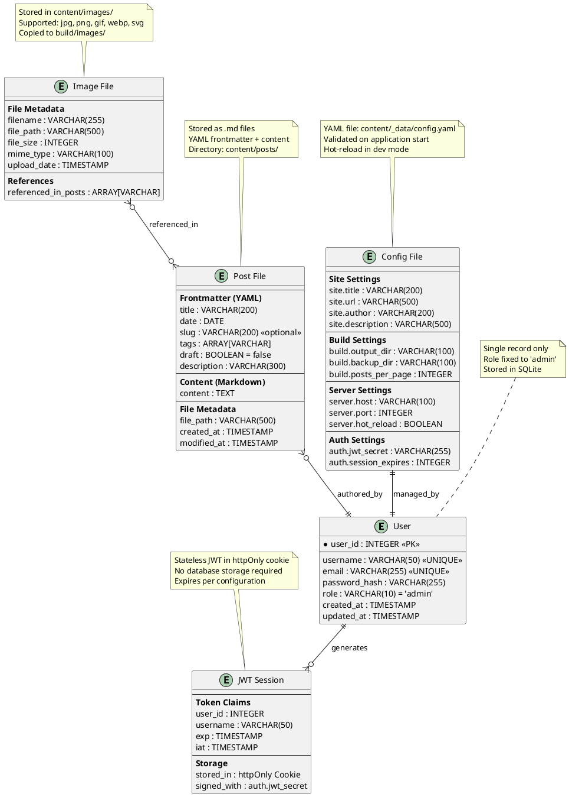

# Task Briefing Package

This package contains all necessary information and strategic guidance for the Coder Agent.

---

## 1. Current Task Details

This is the full specification of the task you must complete.

```json
{
  "task_id": "I1.T3",
  "iteration_id": "I1",
  "iteration_goal": "Establish project foundation, directory structure, core architecture documentation, and basic CLI framework",
  "description": "Create database ERD showing entity relationships between User (SQLite), Post (filesystem), Image (filesystem), Configuration (YAML), and Session (JWT) entities. Include field definitions, data types, and relationship cardinalities.",
  "agent_type_hint": "DiagrammingAgent",
  "inputs": "Data model overview from Section 2, entity definitions from specification, storage strategy (hybrid SQLite + filesystem)",
  "target_files": ["docs/diagrams/database_erd.puml"],
  "input_files": [".codemachine/artifacts/plan/01_Plan_Overview_and_Setup.md"],
  "deliverables": "PlantUML ERD file showing all entities and their relationships",
  "acceptance_criteria": "ERD accurately represents data model, shows both SQLite and filesystem entities, includes all required fields from specification, relationship cardinalities are correct",
  "dependencies": ["I1.T1"],
  "parallelizable": true,
  "done": false
}
```

---

## 2. Architectural & Planning Context

The following are the relevant sections from the architecture and plan documents, which I found by analyzing the task description.

### Context: data-model-overview (from 03_System_Structure_and_Data.md)

```markdown
### 3.6. Data Model Overview & ERD

**Description:** The MicroBlog system uses a hybrid data storage approach combining a lightweight SQLite database for user authentication with filesystem-based storage for content. This design minimizes external dependencies while providing structured access to different data types.
```

### Context: key-entities (from 03_System_Structure_and_Data.md)

```markdown
**Key Entities:**

1. **User**: Single admin user with authentication credentials (stored in SQLite)
2. **Post**: Blog posts with metadata and content (stored as markdown files with YAML frontmatter)
3. **Image**: Media files referenced in posts (stored in filesystem with metadata tracking)
4. **Configuration**: System settings and blog metadata (stored as YAML configuration file)
5. **Session**: Authentication sessions (stateless JWT tokens, no persistent storage)
```

### Context: data-model-diagram (from 03_System_Structure_and_Data.md)

```markdown
**Diagram (PlantUML - ERD):**

```

### Context: data-storage-strategy (from 03_System_Structure_and_Data.md)

```markdown
**Data Storage Strategy:**

**SQLite Database (microblog.db):**
- Stores single user authentication record
- Lightweight, serverless, no external dependencies
- Automatic schema creation on first run
- Handles concurrent read access (dashboard operations)

**File System Storage (content/):**
- Markdown files with YAML frontmatter for posts
- Images stored in organized directory structure
- Configuration as human-readable YAML
- Version control friendly (Git integration possible)
- Direct file system access for build process

**Generated Output (build/):**
- Static HTML, CSS, and JavaScript files
- Copied and optimized images
- RSS feed and sitemap generation
- Atomic generation with backup/rollback
- Deployable to any static file server

**Performance Considerations:**
- File system operations optimized for sequential reading during builds
- SQLite provides excellent performance for single-user authentication
- Content directory structure designed for efficient traversal
- Build output optimized for CDN and static hosting performance
```

### Context: directory-structure (from 01_Plan_Overview_and_Setup.md)

```markdown
## 3. Directory Structure

*   **Root Directory:** `microblog/`
*   **Structure Definition:** Organized for clear separation of concerns with dedicated locations for source code, templates, content, and generated artifacts.

~~~
microblog/
├── microblog/                      # Main Python package
│   ├── __init__.py
│   ├── builder/                    # Static site generation
│   │   ├── __init__.py
│   │   ├── generator.py            # Main build orchestration
│   │   ├── markdown_processor.py   # Markdown parsing and frontmatter
│   │   ├── template_renderer.py    # Jinja2 template rendering
│   │   └── asset_manager.py        # Image and static file copying
│   ├── server/                     # Web application and dashboard
│   │   ├── __init__.py
│   │   ├── app.py                  # FastAPI application setup
│   │   ├── routes/
│   │   │   ├── __init__.py
│   │   │   ├── auth.py             # Authentication endpoints
│   │   │   ├── dashboard.py        # Dashboard page routes
│   │   │   └── api.py              # HTMX API endpoints
│   │   ├── middleware.py           # Auth and CSRF middleware
│   │   ├── models.py               # Pydantic request/response models
│   │   └── config.py               # Configuration management
│   ├── auth/                       # Authentication and user management
│   │   ├── __init__.py
│   │   ├── models.py               # User SQLite model
│   │   ├── jwt_handler.py          # JWT token management
│   │   └── password.py             # Password hashing utilities
│   ├── content/                    # Content management services
│   │   ├── __init__.py
│   │   ├── post_service.py         # Post CRUD operations
│   │   ├── image_service.py        # Image upload and management
│   │   └── validators.py           # Content validation logic
│   ├── cli.py                      # Click-based CLI interface
│   └── utils.py                    # Shared utilities and helpers
├── templates/                      # Jinja2 templates for site generation
│   ├── base.html                   # Base template with common structure
│   ├── index.html                  # Homepage template
│   ├── post.html                   # Individual post template
│   ├── archive.html                # Post listing/archive template
│   ├── tag.html                    # Tag-based post listing
│   ├── rss.xml                     # RSS feed template
│   └── dashboard/                  # Dashboard-specific templates
│       ├── layout.html             # Dashboard base template
│       ├── login.html              # Authentication form
│       ├── posts_list.html         # Post management interface
│       ├── post_edit.html          # Post creation/editing form
│       └── settings.html           # Configuration management
├── static/                         # Static assets for dashboard and site
│   ├── css/
│   │   ├── dashboard.css           # Dashboard-specific styles
│   │   └── site.css                # Public site styles (Pico.css based)
│   ├── js/
│   │   ├── htmx.min.js             # Vendored HTMX library
│   │   └── dashboard.js            # Minimal dashboard JavaScript
│   └── images/
│       └── favicon.ico             # Site favicon
├── docs/                           # Documentation and design artifacts
│   ├── diagrams/                   # UML diagrams (PlantUML source files)
│   │   ├── component_diagram.puml
│   │   ├── database_erd.puml
│   │   ├── auth_flow.puml
│   │   ├── build_process.puml
│   │   └── deployment.puml
│   ├── adr/                        # Architectural Decision Records
│   │   ├── 001-static-first-architecture.md
│   │   ├── 002-single-user-design.md
│   │   └── 003-full-rebuild-strategy.md
│   └── api/                        # API documentation
│       └── openapi.yaml            # OpenAPI v3 specification
├── content/                        # User content directory (runtime)
│   ├── posts/                      # Markdown blog posts
│   ├── pages/                      # Static pages (about, contact, etc.)
│   ├── images/                     # User-uploaded images
│   └── _data/
│       └── config.yaml             # Site configuration
├── build/                          # Generated static site (gitignored)
├── build.bak/                      # Build backup directory (gitignored)
├── tests/                          # Test suite
│   ├── unit/                       # Unit tests for individual components
│   ├── integration/                # Integration tests for API endpoints
│   └── e2e/                        # End-to-end tests for workflows
├── scripts/                        # Deployment and utility scripts
│   ├── deploy.sh                   # Production deployment script
│   ├── backup.sh                   # Content backup script
│   └── dev-setup.sh                # Development environment setup
├── pyproject.toml                  # Python project configuration
├── requirements.txt                # Python dependencies
├── Dockerfile                      # Container deployment
├── docker-compose.yml              # Local development with Docker
├── .gitignore                      # Git ignore rules
├── README.md                       # Project documentation
└── Makefile                        # Development shortcuts
~~~
```

### Context: task-i1-t3 (from 02_Iteration_I1.md)

```markdown
<!-- anchor: task-i1-t3 -->
*   **Task 1.3:**
    *   **Task ID:** `I1.T3`
    *   **Description:** Create database ERD showing entity relationships between User (SQLite), Post (filesystem), Image (filesystem), Configuration (YAML), and Session (JWT) entities. Include field definitions, data types, and relationship cardinalities.
    *   **Agent Type Hint:** `DiagrammingAgent`
    *   **Inputs:** Data model overview from Section 2, entity definitions from specification, storage strategy (hybrid SQLite + filesystem)
    *   **Input Files:** [".codemachine/artifacts/plan/01_Plan_Overview_and_Setup.md"]
    *   **Target Files:** ["docs/diagrams/database_erd.puml"]
    *   **Deliverables:** PlantUML ERD file showing all entities and their relationships
    *   **Acceptance Criteria:** ERD accurately represents data model, shows both SQLite and filesystem entities, includes all required fields from specification, relationship cardinalities are correct
```

---

## 3. Codebase Analysis & Strategic Guidance

The following analysis is based on my direct review of the current codebase. Use these notes and tips to guide your implementation.

### Relevant Existing Code

*   **File:** `docs/diagrams/component_diagram.puml`
    *   **Summary:** This file contains the existing PlantUML component diagram showing the dashboard application architecture with C4 notation.
    *   **Recommendation:** You SHOULD use the same PlantUML format and style conventions as this existing diagram. Note it uses the C4-PlantUML library with `!include https://raw.githubusercontent.com/plantuml-stdlib/C4-PlantUML/master/C4_Component.puml`.

*   **File:** `pyproject.toml`
    *   **Summary:** This file contains the project configuration and dependencies including database-related packages.
    *   **Recommendation:** Note that the project already includes `pyyaml>=6.0.0` for YAML processing, `passlib[bcrypt]>=1.7.0` for password hashing, and `python-jose[cryptography]>=3.3.0` for JWT handling. Your ERD should reflect these technology choices.

*   **File:** `microblog/cli.py`
    *   **Summary:** This file contains the CLI interface with user creation command placeholders.
    *   **Recommendation:** The ERD should align with the user management functionality shown in the `create_user` command, which handles username and password fields.

*   **File:** `microblog/utils.py`
    *   **Summary:** This file provides utility functions for directory management and path resolution.
    *   **Recommendation:** Your ERD should reference the directory structure implied by functions like `get_content_dir()`, `get_build_dir()`, etc.

### Implementation Tips & Notes

*   **Tip:** The architecture document already contains a complete PlantUML ERD that you can use as a reference model. However, you need to create the actual `.puml` file in the `docs/diagrams/` directory as specified in the target files.

*   **Note:** The data model uses a hybrid storage strategy - User data in SQLite, everything else in filesystem. Make sure your ERD clearly distinguishes between these storage types, potentially using different visual styling or notes.

*   **Warning:** The ERD must be saved as `database_erd.puml` in the `docs/diagrams/` directory. The directory already exists and contains `component_diagram.puml`, so follow the same naming and format conventions.

*   **Critical:** The acceptance criteria requires "relationship cardinalities are correct". Pay special attention to:
  - User to Session: One-to-many (user can have multiple JWT sessions)
  - User to Post: One-to-many (user authors multiple posts)
  - Post to Image: Many-to-many (posts can reference multiple images, images can be referenced by multiple posts)
  - User to Configuration: One-to-one (single user manages single config)

*   **Storage Note:** The ERD should clearly indicate storage mechanisms in entity notes, similar to the architecture document's approach with comments like "Stored in SQLite" vs "Stored as .md files".