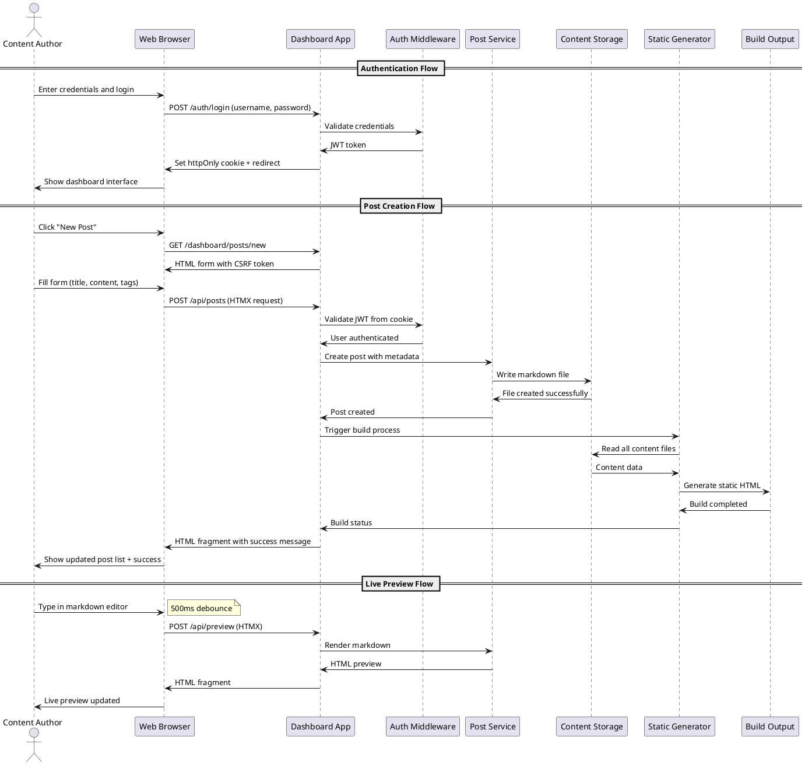

# Task Briefing Package

This package contains all necessary information and strategic guidance for the Coder Agent.

---

## 1. Current Task Details

This is the full specification of the task you must complete.

```json
{
  "task_id": "I2.T2",
  "iteration_id": "I2",
  "iteration_goal": "Implement authentication system with JWT tokens, user management, and core data models for posts and images",
  "description": "Generate authentication flow sequence diagram showing JWT-based login process, session management, and dashboard access protection. Include httpOnly cookie handling and CSRF protection.",
  "agent_type_hint": "DiagrammingAgent",
  "inputs": "Authentication requirements from specification, JWT workflow, security considerations",
  "target_files": ["docs/diagrams/auth_flow.puml"],
  "input_files": ["docs/api/openapi.yaml"],
  "deliverables": "PlantUML sequence diagram showing complete authentication workflow",
  "acceptance_criteria": "Diagram accurately shows JWT token lifecycle, cookie handling is illustrated, CSRF protection flow included, all security steps documented",
  "dependencies": ["I2.T1"],
  "parallelizable": true,
  "done": false
}
```

---

## 2. Architectural & Planning Context

The following are the relevant sections from the architecture and plan documents, which I found by analyzing the task description.

### Context: authentication-authorization (from 05_Operational_Architecture.md)

```markdown
**Authentication & Authorization:**

**Authentication Strategy:**
- **Single-User Design**: System supports exactly one admin user with fixed role
- **JWT-Based Sessions**: Stateless authentication using JSON Web Tokens
- **Secure Token Storage**: JWT stored in httpOnly, Secure, SameSite=Strict cookies
- **Password Security**: Bcrypt hashing with cost factor ≥12 for password storage
- **Session Management**: Configurable token expiration (default 2 hours)

**Implementation Details:**
```python
# Authentication flow
def authenticate_user(username: str, password: str) -> Optional[User]:
    user = get_user_by_username(username)
    if user and verify_password(password, user.password_hash):
        token = create_jwt_token(user.user_id, user.username)
        return user, token
    return None

# JWT Token Structure
{
    "user_id": 1,
    "username": "admin",
    "role": "admin",
    "exp": 1635724800,  # Expiration timestamp
    "iat": 1635721200   # Issued at timestamp
}
```

**Authorization Model:**
- **Role-Based**: Single admin role with full system access
- **Route Protection**: Middleware validates JWT for protected endpoints
- **CSRF Protection**: All state-changing operations require valid CSRF tokens
- **Session Validation**: Automatic token expiration and renewal handling
```

### Context: key-interaction-flow (from 04_Behavior_and_Communication.md)

```markdown
**Key Interaction Flow (Sequence Diagram):**

**Description:** This diagram illustrates the complete workflow for user authentication and post creation, showing the interaction between the web browser, dashboard application, authentication system, and content storage.

**Diagram (PlantUML):**

```

### Context: security-considerations (from 05_Operational_Architecture.md)

```markdown
**Security Considerations:**

**Input Validation & Sanitization:**
- **Markdown Sanitization**: HTML escaping by default to prevent XSS attacks
- **File Upload Validation**: Extension whitelist, MIME type verification, size limits
- **Path Traversal Prevention**: Filename sanitization and directory boundary enforcement
- **SQL Injection Prevention**: Parameterized queries for all database operations
- **Command Injection Prevention**: No direct shell execution from user input

**Security Headers:**
```python
# Security middleware configuration
SECURITY_HEADERS = {
    "X-Content-Type-Options": "nosniff",
    "X-Frame-Options": "DENY",
    "X-XSS-Protection": "1; mode=block",
    "Strict-Transport-Security": "max-age=31536000; includeSubDomains",
    "Content-Security-Policy": "default-src 'self'; style-src 'self' 'unsafe-inline'"
}
```

**Data Protection:**
- **Secrets Management**: JWT secret stored in configuration with minimum 32-character requirement
- **Database Security**: SQLite file permissions restricted to application user
- **File System Security**: Content directory permissions preventing unauthorized access
- **Backup Security**: Build backups stored with same security constraints as primary data

**Vulnerability Mitigation:**
- **Rate Limiting**: Authentication endpoint protection against brute force attacks
- **CSRF Protection**: Synchronizer token pattern for all state-changing operations
- **Session Security**: Automatic token expiration and secure cookie attributes
- **Dependency Scanning**: Regular security updates for Python dependencies
```

### Context: authentication endpoints (from docs/api/openapi.yaml)

```markdown
  /auth/login:
    post:
      tags:
        - Authentication
      summary: User authentication
      description: |
        Authenticate user with credentials and return JWT token in httpOnly cookie.
        Validates username/password and sets secure session cookie.
      security: []
      requestBody:
        required: true
        content:
          application/x-www-form-urlencoded:
            schema:
              type: object
              required:
                - username
                - password
                - csrf_token
              properties:
                username:
                  type: string
                  minLength: 1
                  maxLength: 100
                  description: Username for authentication
                password:
                  type: string
                  minLength: 1
                  maxLength: 255
                  description: Password for authentication
                csrf_token:
                  type: string
                  description: CSRF protection token
      responses:
        '302':
          description: Authentication successful, redirect to dashboard
          headers:
            Location:
              schema:
                type: string
                example: /dashboard
            Set-Cookie:
              schema:
                type: string
                example: jwt=eyJhbGciOiJIUzI1NiIsInR5cCI6IkpXVCJ9...; HttpOnly; Secure; SameSite=Strict; Max-Age=7200

  /auth/logout:
    post:
      tags:
        - Authentication
      summary: User logout
      description: Terminate session and clear authentication cookie
      responses:
        '302':
          description: Logout successful, redirect to login
          headers:
            Location:
              schema:
                type: string
                example: /auth/login
            Set-Cookie:
              schema:
                type: string
                example: jwt=; Expires=Thu, 01 Jan 1970 00:00:00 GMT; HttpOnly; Secure; SameSite=Strict

  /auth/check:
    get:
      tags:
        - Authentication
      summary: Session validation
      description: Validate current session for protected routes
      responses:
        '200':
          description: Valid session
          content:
            application/json:
              schema:
                type: object
                properties:
                  valid:
                    type: boolean
                    example: true
                  user:
                    type: string
                    example: admin
```

---

## 3. Codebase Analysis & Strategic Guidance

The following analysis is based on my direct review of the current codebase. Use these notes and tips to guide your implementation.

### Relevant Existing Code

*   **File:** `docs/api/openapi.yaml`
    *   **Summary:** Complete OpenAPI v3 specification already created (task I2.T1) that defines all authentication endpoints, security schemes, and data models including JWT cookie authentication and CSRF protection.
    *   **Recommendation:** You MUST use this OpenAPI specification as the authoritative source for authentication flow details. The endpoints /auth/login, /auth/logout, and /auth/check are fully documented with request/response formats.

*   **File:** `microblog/server/config.py`
    *   **Summary:** Comprehensive configuration management system with AuthConfig that includes JWT secret requirements (minimum 32 characters) and session expiration settings (default 2 hours).
    *   **Recommendation:** You SHOULD reference the AuthConfig model when showing JWT configuration in your diagram, particularly the session_expires setting.

*   **File:** `content/_data/config.yaml`
    *   **Summary:** Default configuration file showing jwt_secret and session_expires settings that will be used by the authentication system.
    *   **Recommendation:** You can reference these specific configuration values in your diagram to show realistic JWT expiration timeframes.

*   **File:** `microblog/cli.py`
    *   **Summary:** CLI includes a create_user command (currently TODO placeholder) that will handle initial user creation for the single-user system.
    *   **Recommendation:** Your authentication flow diagram should account for the fact that user creation happens via CLI, not through the web interface.

### Implementation Tips & Notes

*   **Tip:** The existing architectural documentation shows a detailed sequence diagram template in 04_Behavior_and_Communication.md that you SHOULD use as a structural reference for your authentication flow diagram.
*   **Note:** The system uses a single-user design pattern - your diagram should reflect that there's only one admin user with full system access, not a multi-user system.
*   **Security Focus:** The OpenAPI spec and architecture docs emphasize several security features that MUST be included in your diagram:
    - httpOnly, Secure, SameSite=Strict cookie attributes
    - CSRF token validation for state-changing operations
    - JWT token expiration and renewal handling
    - Rate limiting on authentication endpoints (future enhancement)
*   **Dependencies Available:** The pyproject.toml shows python-jose[cryptography] and passlib[bcrypt] are available for JWT handling and password hashing - these libraries should be referenced in any implementation details.
*   **Diagram Location:** Your target file `docs/diagrams/auth_flow.puml` should be placed alongside existing component_diagram.puml and database_erd.puml files.

### Critical Requirements from Task Description

*   **JWT Token Lifecycle:** Show complete flow from credential validation to token creation, storage in httpOnly cookie, and eventual expiration
*   **Cookie Handling:** Illustrate secure cookie attributes (httpOnly, Secure, SameSite=Strict) and cookie clearing on logout
*   **CSRF Protection:** Show how CSRF tokens are generated, included in forms, and validated on state-changing operations
*   **Dashboard Access Protection:** Demonstrate how middleware validates JWT tokens before allowing access to protected dashboard routes
*   **Session Management:** Include automatic token expiration handling and session validation for ongoing requests