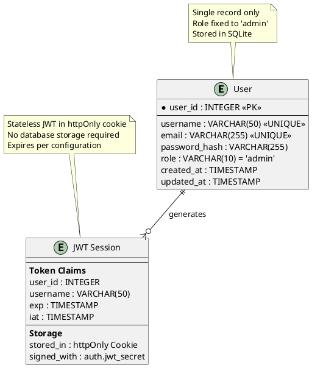

# Task Briefing Package

This package contains all necessary information and strategic guidance for the Coder Agent.

---

## 1. Current Task Details

This is the full specification of the task you must complete.

```json
{
  "task_id": "I2.T3",
  "iteration_id": "I2",
  "iteration_goal": "Implement authentication system with JWT tokens, user management, and core data models for posts and images",
  "description": "Implement User model with SQLite database, bcrypt password hashing, and JWT token management. Create database schema and user creation utilities.",
  "agent_type_hint": "BackendAgent",
  "inputs": "User model specification, security requirements (bcrypt cost ≥12), JWT configuration",
  "target_files": ["microblog/auth/models.py", "microblog/auth/jwt_handler.py", "microblog/auth/password.py", "microblog/database.py"],
  "input_files": ["microblog/server/config.py", "docs/diagrams/database_erd.puml"],
  "deliverables": "User SQLite model, password hashing utilities, JWT token generation/validation, database initialization",
  "acceptance_criteria": "User creation works correctly, passwords hash with bcrypt cost ≥12, JWT tokens generate and validate properly, database initializes automatically",
  "dependencies": ["I1.T4"],
  "parallelizable": false,
  "done": false
}
```

---

## 2. Architectural & Planning Context

The following are the relevant sections from the architecture and plan documents, which I found by analyzing the task description.

### Context: key-entities (from 03_System_Structure_and_Data.md)

```markdown
**Key Entities:**

1. **User**: Single admin user with authentication credentials (stored in SQLite)
2. **Post**: Blog posts with metadata and content (stored as markdown files with YAML frontmatter)
3. **Image**: Media files referenced in posts (stored in filesystem with metadata tracking)
4. **Configuration**: System settings and blog metadata (stored as YAML configuration file)
5. **Session**: Authentication sessions (stateless JWT tokens, no persistent storage)
```

### Context: data-model-diagram (from 03_System_Structure_and_Data.md)

```markdown
**Diagram (PlantUML - ERD):**

```

### Context: data-storage-strategy (from 03_System_Structure_and_Data.md)

```markdown
**Data Storage Strategy:**

**SQLite Database (microblog.db):**
- Stores single user authentication record
- Lightweight, serverless, no external dependencies
- Automatic schema creation on first run
- Handles concurrent read access (dashboard operations)

**Performance Considerations:**
- File system operations optimized for sequential reading during builds
- SQLite provides excellent performance for single-user authentication
- Content directory structure designed for efficient traversal
- Build output optimized for CDN and static hosting performance
```

### Context: authentication-authorization (from 05_Operational_Architecture.md)

```markdown
**Authentication & Authorization:**

**Authentication Strategy:**
- **Single-User Design**: System supports exactly one admin user with fixed role
- **JWT-Based Sessions**: Stateless authentication using JSON Web Tokens
- **Secure Token Storage**: JWT stored in httpOnly, Secure, SameSite=Strict cookies
- **Password Security**: Bcrypt hashing with cost factor ≥12 for password storage
- **Session Management**: Configurable token expiration (default 2 hours)

**Implementation Details:**
```python
# Authentication flow
def authenticate_user(username: str, password: str) -> Optional[User]:
    user = get_user_by_username(username)
    if user and verify_password(password, user.password_hash):
        token = create_jwt_token(user.user_id, user.username)
        return user, token
    return None

# JWT Token Structure
{
    "user_id": 1,
    "username": "admin",
    "role": "admin",
    "exp": 1635724800,  # Expiration timestamp
    "iat": 1635721200   # Issued at timestamp
}
```

**Authorization Model:**
- **Role-Based**: Single admin role with full system access
- **Route Protection**: Middleware validates JWT for protected endpoints
- **CSRF Protection**: All state-changing operations require valid CSRF tokens
- **Session Validation**: Automatic token expiration and renewal handling
```

### Context: task-i2-t3 (from 02_Iteration_I2.md)

```markdown
*   **Task 2.3:**
    *   **Task ID:** `I2.T3`
    *   **Description:** Implement User model with SQLite database, bcrypt password hashing, and JWT token management. Create database schema and user creation utilities.
    *   **Agent Type Hint:** `BackendAgent`
    *   **Inputs:** User model specification, security requirements (bcrypt cost ≥12), JWT configuration
    *   **Input Files:** ["microblog/server/config.py", "docs/diagrams/database_erd.puml"]
    *   **Target Files:** ["microblog/auth/models.py", "microblog/auth/jwt_handler.py", "microblog/auth/password.py", "microblog/database.py"]
    *   **Deliverables:** User SQLite model, password hashing utilities, JWT token generation/validation, database initialization
    *   **Acceptance Criteria:** User creation works correctly, passwords hash with bcrypt cost ≥12, JWT tokens generate and validate properly, database initializes automatically
    *   **Dependencies:** `I1.T4`
    *   **Parallelizable:** No
```

---

## 3. Codebase Analysis & Strategic Guidance

The following analysis is based on my direct review of the current codebase. Use these notes and tips to guide your implementation.

### Relevant Existing Code
*   **File:** `microblog/server/config.py`
    *   **Summary:** This file contains the complete configuration management system with Pydantic models for AuthConfig including jwt_secret and session_expires settings. It has a fully functional ConfigManager class with YAML loading and validation.
    *   **Recommendation:** You MUST import and use the `AuthConfig` class from this file for JWT configuration. Use `get_config()` function to access configuration settings including auth.jwt_secret and auth.session_expires.
*   **File:** `microblog/utils.py`
    *   **Summary:** This file provides utility functions including ensure_directory() for creating directories and get_project_root() for path management.
    *   **Recommendation:** You SHOULD use the `ensure_directory()` function when creating database directory structure and `get_project_root()` for database file placement.
*   **File:** `pyproject.toml`
    *   **Summary:** This file defines all project dependencies including `python-jose[cryptography]` for JWT handling and `passlib[bcrypt]` for password hashing.
    *   **Recommendation:** You MUST use the already declared dependencies. Import `jose.jwt` for JWT operations and `passlib.context.CryptContext` for bcrypt password hashing.
*   **File:** `docs/diagrams/database_erd.puml`
    *   **Summary:** This file contains the complete User entity definition with all required fields: user_id (PK), username, email, password_hash, role, created_at, updated_at.
    *   **Recommendation:** You MUST implement the exact schema defined in this ERD. Note that role is fixed to 'admin' and the system supports only a single user record.

### Implementation Tips & Notes
*   **Tip:** The configuration system is already complete. Use `from microblog.server.config import get_config` to access authentication settings including JWT secret and session expiration time.
*   **Note:** The project uses Python 3.10+ with type hints throughout. You MUST follow the same typing patterns seen in config.py (using `|` for unions and modern type annotations).
*   **Warning:** The ERD specifies that the system supports exactly one admin user. Your User model should account for this constraint and prevent multiple user creation.
*   **Database Location:** You SHOULD place the SQLite database file at the project root level (same level as pyproject.toml) and name it `microblog.db` for consistency.
*   **Security Requirement:** The bcrypt cost factor MUST be ≥12 as specified in the acceptance criteria. Use PassLib's CryptContext with bcrypt scheme.
*   **JWT Secret:** The JWT secret is validated to be at least 32 characters in the configuration system. Use this for signing tokens.
*   **Directory Structure:** The `microblog/auth/` directory already exists but is empty. You MUST create the required files there following the target_files specification.
*   **Testing Support:** The existing `tests/conftest.py` provides excellent patterns for test fixtures and temporary file handling that you can reference for testing your authentication system.