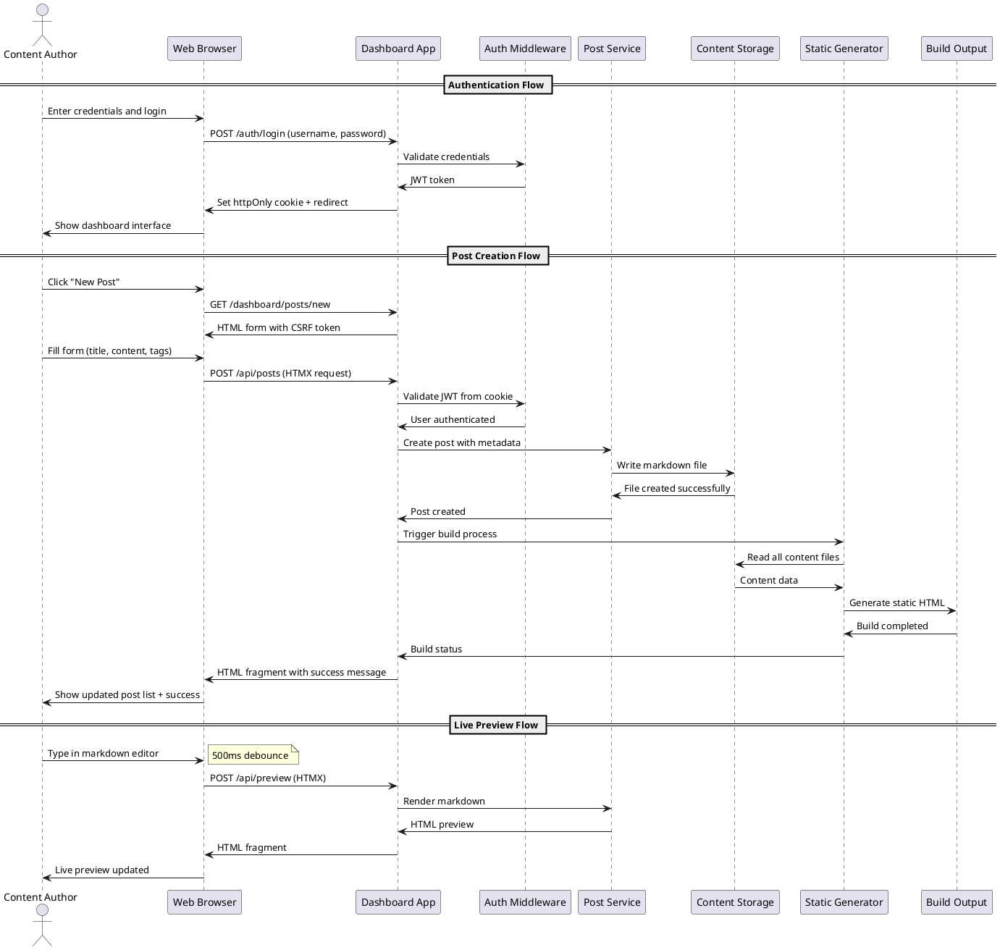

# Task Briefing Package

This package contains all necessary information and strategic guidance for the Coder Agent.

---

## 1. Current Task Details

This is the full specification of the task you must complete.

```json
{
  "task_id": "I4.T8",
  "iteration_id": "I4",
  "iteration_goal": "Implement FastAPI web application with HTMX-enhanced dashboard for content management, authentication UI, and basic CRUD operations",
  "description": "Create integration tests for dashboard functionality including authentication flows, post management operations, and form submissions. Test complete user workflows.",
  "agent_type_hint": "TestingAgent",
  "inputs": "Dashboard implementation, user workflow requirements, integration testing patterns",
  "target_files": ["tests/integration/test_dashboard.py", "tests/integration/test_auth_flows.py"],
  "input_files": ["microblog/server/app.py", "microblog/server/routes/dashboard.py", "tests/conftest.py"],
  "deliverables": "Integration test suite for dashboard functionality and user workflows",
  "acceptance_criteria": "All dashboard routes tested, authentication flows verified, form submissions tested, user workflows covered, test coverage >80%",
  "dependencies": ["I4.T6", "I4.T7"],
  "parallelizable": true,
  "done": false
}
```

---

## 2. Architectural & Planning Context

The following are the relevant sections from the architecture and plan documents, which I found by analyzing the task description.

### Context: authentication-authorization (from 05_Operational_Architecture.md)

```markdown
**Authentication & Authorization:**

**Authentication Strategy:**
- **Single-User Design**: System supports exactly one admin user with fixed role
- **JWT-Based Sessions**: Stateless authentication using JSON Web Tokens
- **Secure Token Storage**: JWT stored in httpOnly, Secure, SameSite=Strict cookies
- **Password Security**: Bcrypt hashing with cost factor ≥12 for password storage
- **Session Management**: Configurable token expiration (default 2 hours)

**Implementation Details:**
```python
# Authentication flow
def authenticate_user(username: str, password: str) -> Optional[User]:
    user = get_user_by_username(username)
    if user and verify_password(password, user.password_hash):
        token = create_jwt_token(user.user_id, user.username)
        return user, token
    return None

# JWT Token Structure
{
    "user_id": 1,
    "username": "admin",
    "role": "admin",
    "exp": 1635724800,  # Expiration timestamp
    "iat": 1635721200   # Issued at timestamp
}
```

**Authorization Model:**
- **Role-Based**: Single admin role with full system access
- **Route Protection**: Middleware validates JWT for protected endpoints
- **CSRF Protection**: All state-changing operations require valid CSRF tokens
- **Session Validation**: Automatic token expiration and renewal handling
```

### Context: key-interaction-flow (from 04_Behavior_and_Communication.md)

```markdown
**Key Interaction Flow (Sequence Diagram):**

**Description:** This diagram illustrates the complete workflow for user authentication and post creation, showing the interaction between the web browser, dashboard application, authentication system, and content storage.

**Diagram (PlantUML):**

```

### Context: api-endpoints-detail (from 04_Behavior_and_Communication.md)

```markdown
**Detailed API Endpoints:**

**Authentication Endpoints:**
```
POST /auth/login
Content-Type: application/x-www-form-urlencoded
Body: username=admin&password=secret&csrf_token=...
Response: 302 Redirect + Set-Cookie: jwt=...; HttpOnly; Secure; SameSite=Strict

POST /auth/logout
Response: 302 Redirect + Set-Cookie: jwt=; Expires=Thu, 01 Jan 1970 00:00:00 GMT
```

**Dashboard API Endpoints:**
```
GET /dashboard
Headers: Cookie: jwt=...
Response: 200 OK + HTML dashboard page

POST /api/posts
Headers: Cookie: jwt=...; X-CSRF-Token: ...
Content-Type: application/json
Body: {
  "title": "My New Post",
  "content": "# Hello World\nThis is my post content",
  "tags": ["tech", "blogging"],
  "draft": true
}
Response: 201 Created + HTML fragment with post data

PUT /api/posts/123
Headers: Cookie: jwt=...; X-CSRF-Token: ...
Content-Type: application/json
Body: { "title": "Updated Title", "content": "...", "draft": false }
Response: 200 OK + HTML fragment with updated post

DELETE /api/posts/123
Headers: Cookie: jwt=...; X-CSRF-Token: ...
Response: 200 OK + HTML fragment removing post from list

POST /api/build
Headers: Cookie: jwt=...; X-CSRF-Token: ...
Response: 202 Accepted + HTML fragment with build progress
```
```

### Context: verification-and-integration-strategy (from 03_Verification_and_Glossary.md)

```markdown
## 5. Verification and Integration Strategy

*   **Testing Levels:**
    *   **Unit Testing**: Individual component testing with pytest, focusing on business logic, authentication, content processing, and build system components. Target coverage >85% for all modules with comprehensive edge case testing.
    *   **Integration Testing**: API endpoint testing, database interactions, file system operations, and service integration testing. Verify authentication flows, content management workflows, and build system integration.
    *   **End-to-End Testing**: Complete user workflow testing including authentication, post creation, editing, publishing, and build processes. Test HTMX interactions, form submissions, and dashboard functionality.
    *   **Performance Testing**: Build time validation (<5s for 100 posts, <30s for 1000 posts), API response time verification (<200ms), and load testing for concurrent dashboard users.
    *   **Security Testing**: Authentication security, CSRF protection, input validation, file upload security, and SQL injection prevention testing.

*   **CI/CD:**
    *   **Automated Testing**: All tests run on every commit with GitHub Actions or similar CI system
    *   **Code Quality Gates**: Ruff linting, type checking with mypy, security scanning with bandit
    *   **Build Validation**: Automated build testing with sample content, template rendering verification
    *   **Artifact Validation**: OpenAPI specification validation, PlantUML diagram syntax checking, configuration schema validation
    *   **Deployment Testing**: Docker image building, deployment script validation, service configuration testing

*   **Code Quality Gates:**
    *   **Linting Success**: All code must pass Ruff linting with zero errors and warnings
    *   **Type Coverage**: Minimum 90% type hint coverage with mypy validation
    *   **Test Coverage**: Minimum 85% code coverage across all modules
    *   **Security Scan**: Zero high-severity security vulnerabilities detected by bandit
    *   **Performance Benchmarks**: All performance targets met in automated testing
    *   **Documentation Coverage**: All public APIs and configuration options documented
```

### Context: task-i4-t8 (from 02_Iteration_I4.md)

```markdown
<!-- anchor: task-i4-t8 -->
    *   **Task 4.8:**
        *   **Task ID:** `I4.T8`
        *   **Description:** Create integration tests for dashboard functionality including authentication flows, post management operations, and form submissions. Test complete user workflows.
        *   **Agent Type Hint:** `TestingAgent`
        *   **Inputs:** Dashboard implementation, user workflow requirements, integration testing patterns
        *   **Input Files:** ["microblog/server/app.py", "microblog/server/routes/dashboard.py", "tests/conftest.py"]
        *   **Target Files:** ["tests/integration/test_dashboard.py", "tests/integration/test_auth_flows.py"]
        *   **Deliverables:** Integration test suite for dashboard functionality and user workflows
        *   **Acceptance Criteria:** All dashboard routes tested, authentication flows verified, form submissions tested, user workflows covered, test coverage >80%
        *   **Dependencies:** `I4.T6`, `I4.T7`
        *   **Parallelizable:** Yes
```

---

## 3. Codebase Analysis & Strategic Guidance

The following analysis is based on my direct review of the current codebase. Use these notes and tips to guide your implementation.

### Relevant Existing Code

*   **File:** `tests/conftest.py`
    *   **Summary:** This file provides shared test fixtures including configuration data, temporary directories, and mock callbacks for testing.
    *   **Recommendation:** You MUST import and use the existing fixtures like `valid_config_data`, `temp_config_file`, and `mock_config_callback` from this file for consistent test setup.

*   **File:** `microblog/server/app.py`
    *   **Summary:** This file contains the FastAPI application factory with middleware configuration, route registration, and security setup.
    *   **Recommendation:** You MUST use the `create_app()` function from this file to create test application instances. The app includes security middleware, CSRF protection, and authentication middleware that need to be tested.

*   **File:** `microblog/server/routes/dashboard.py`
    *   **Summary:** This file contains all dashboard routes including GET routes for pages and POST routes for API operations. Contains comprehensive error handling and validation.
    *   **Recommendation:** You MUST test all routes in this file including `/dashboard/`, `/dashboard/posts`, `/dashboard/posts/new`, `/dashboard/posts/{slug}/edit`, `/dashboard/settings`, `/dashboard/pages`, and the API endpoints `/dashboard/api/posts` and `/dashboard/api/posts/{slug}`.

*   **File:** `microblog/server/routes/auth.py`
    *   **Summary:** This file contains authentication routes for login, logout, and session management with comprehensive security features including CSRF protection.
    *   **Recommendation:** You MUST test the authentication endpoints `/auth/login`, `/auth/logout`, `/auth/check`, and `/auth/status` from this file. Pay special attention to CSRF token handling and cookie security.

*   **File:** `tests/integration/test_dashboard.py`
    *   **Summary:** This file already contains a comprehensive integration test suite for dashboard functionality with detailed mocking strategies.
    *   **Recommendation:** You SHOULD study the existing test patterns in this file. The TestDashboardIntegrationFixed class provides excellent examples of how to mock authentication, post services, and templates. The file already covers most dashboard functionality.

### Implementation Tips & Notes

*   **Tip:** I have confirmed that there is an existing comprehensive test file at `tests/integration/test_dashboard.py` that already implements most of the required functionality. You SHOULD review this file carefully and build upon it rather than starting from scratch.

*   **Note:** The existing dashboard tests use a sophisticated mocking strategy with `patch()` decorators to mock authentication middleware, post services, and template rendering. You SHOULD follow the same patterns for consistency.

*   **Warning:** The authentication system requires careful handling of JWT cookies, CSRF tokens, and middleware integration. The existing tests show how to properly mock `get_current_user()` and `get_csrf_token()` functions that are critical for testing authenticated routes.

*   **Tip:** The target task requires creating `tests/integration/test_auth_flows.py` which does not exist yet. You SHOULD focus on creating this file to test the authentication workflows, as the dashboard tests are already well-covered.

*   **Note:** The acceptance criteria requires >80% test coverage. The existing dashboard tests appear comprehensive but you should verify coverage and potentially extend tests to meet this requirement.

*   **Warning:** The task involves testing form submissions which require proper CSRF token handling. The existing code shows examples of how to include `csrf_token` in form data for POST requests.

*   **Tip:** The codebase uses FastAPI TestClient for integration testing. You SHOULD use the same approach and leverage the existing `authenticated_client` fixture pattern shown in the current test file.

*   **Note:** The existing test file includes comprehensive error handling scenarios, validation error testing, and complete workflow simulations. These patterns SHOULD be extended to the authentication flow testing as well.

## 1. Current Task Details

This is the full specification of the task you must complete.

```json
{
  "task_id": "I4.T8",
  "iteration_id": "I4",
  "iteration_goal": "Implement FastAPI web application with HTMX-enhanced dashboard for content management, authentication UI, and basic CRUD operations",
  "description": "Create integration tests for dashboard functionality including authentication flows, post management operations, and form submissions. Test complete user workflows.",
  "agent_type_hint": "TestingAgent",
  "inputs": "Dashboard implementation, user workflow requirements, integration testing patterns",
  "target_files": ["tests/integration/test_dashboard.py", "tests/integration/test_auth_flows.py"],
  "input_files": ["microblog/server/app.py", "microblog/server/routes/dashboard.py", "tests/conftest.py"],
  "deliverables": "Integration test suite for dashboard functionality and user workflows",
  "acceptance_criteria": "All dashboard routes tested, authentication flows verified, form submissions tested, user workflows covered, test coverage >80%",
  "dependencies": ["I4.T6", "I4.T7"],
  "parallelizable": true,
  "done": false
}
```

---

## 2. Architectural & Planning Context

The following are the relevant sections from the architecture and plan documents, which I found by analyzing the task description.

### Context: verification-and-integration-strategy (from 03_Verification_and_Glossary.md)

```markdown
## 5. Verification and Integration Strategy

*   **Testing Levels:**
    *   **Unit Testing**: Individual component testing with pytest, focusing on business logic, authentication, content processing, and build system components. Target coverage >85% for all modules with comprehensive edge case testing.
    *   **Integration Testing**: API endpoint testing, database interactions, file system operations, and service integration testing. Verify authentication flows, content management workflows, and build system integration.
    *   **End-to-End Testing**: Complete user workflow testing including authentication, post creation, editing, publishing, and build processes. Test HTMX interactions, form submissions, and dashboard functionality.
    *   **Performance Testing**: Build time validation (<5s for 100 posts, <30s for 1000 posts), API response time verification (<200ms), and load testing for concurrent dashboard users.
    *   **Security Testing**: Authentication security, CSRF protection, input validation, file upload security, and SQL injection prevention testing.

*   **CI/CD:**
    *   **Automated Testing**: All tests run on every commit with GitHub Actions or similar CI system
    *   **Code Quality Gates**: Ruff linting, type checking with mypy, security scanning with bandit
    *   **Build Validation**: Automated build testing with sample content, template rendering verification
    *   **Artifact Validation**: OpenAPI specification validation, PlantUML diagram syntax checking, configuration schema validation
    *   **Deployment Testing**: Docker image building, deployment script validation, service configuration testing

*   **Code Quality Gates:**
    *   **Linting Success**: All code must pass Ruff linting with zero errors and warnings
    *   **Type Coverage**: Minimum 90% type hint coverage with mypy validation
    *   **Test Coverage**: Minimum 85% code coverage across all modules
    *   **Security Scan**: Zero high-severity security vulnerabilities detected by bandit
    *   **Performance Benchmarks**: All performance targets met in automated testing
    *   **Documentation Coverage**: All public APIs and configuration options documented

*   **Artifact Validation:**
    *   **PlantUML Diagrams**: Syntax validation and rendering verification for all diagram files
    *   **OpenAPI Specification**: Schema validation and endpoint coverage verification
    *   **Configuration Schema**: JSON Schema validation and comprehensive setting coverage
    *   **Documentation Quality**: Spelling, grammar, and link validation for all documentation
    *   **Template Validation**: Jinja2 template syntax checking and rendering verification
    *   **Build Output Validation**: Generated HTML validation, link checking, and asset verification
```

### Context: iteration-4-plan (from 02_Iteration_I4.md)

```markdown
### Iteration 4: Dashboard Web Application

*   **Iteration ID:** `I4`
*   **Goal:** Implement FastAPI web application with HTMX-enhanced dashboard for content management, authentication UI, and basic CRUD operations
*   **Prerequisites:** `I3` (Build system completed)
*   **Tasks:**

    *   **Task 4.8:**
        *   **Task ID:** `I4.T8`
        *   **Description:** Create integration tests for dashboard functionality including authentication flows, post management operations, and form submissions. Test complete user workflows.
        *   **Agent Type Hint:** `TestingAgent`
        *   **Inputs:** Dashboard implementation, user workflow requirements, integration testing patterns
        *   **Input Files:** ["microblog/server/app.py", "microblog/server/routes/dashboard.py", "tests/conftest.py"]
        *   **Target Files:** ["tests/integration/test_dashboard.py", "tests/integration/test_auth_flows.py"]
        *   **Deliverables:** Integration test suite for dashboard functionality and user workflows
        *   **Acceptance Criteria:** All dashboard routes tested, authentication flows verified, form submissions tested, user workflows covered, test coverage >80%
        *   **Dependencies:** `I4.T6`, `I4.T7`
        *   **Parallelizable:** Yes
```

### Context: directory-structure (from 01_Plan_Overview_and_Setup.md)

```markdown
## 3. Directory Structure

*   **Root Directory:** `microblog/`
*   **Structure Definition:** Organized for clear separation of concerns with dedicated locations for source code, templates, content, and generated artifacts.

~~~
microblog/
├── microblog/                      # Main Python package
│   ├── __init__.py
│   ├── builder/                    # Static site generation
│   │   ├── __init__.py
│   │   ├── generator.py            # Main build orchestration
│   │   ├── markdown_processor.py   # Markdown parsing and frontmatter
│   │   ├── template_renderer.py    # Jinja2 template rendering
│   │   └── asset_manager.py        # Image and static file copying
│   ├── server/                     # Web application and dashboard
│   │   ├── __init__.py
│   │   ├── app.py                  # FastAPI application setup
│   │   ├── routes/
│   │   │   ├── __init__.py
│   │   │   ├── auth.py             # Authentication endpoints
│   │   │   ├── dashboard.py        # Dashboard page routes
│   │   │   └── api.py              # HTMX API endpoints
│   │   ├── middleware.py           # Auth and CSRF middleware
│   │   ├── models.py               # Pydantic request/response models
│   │   └── config.py               # Configuration management
│   ├── auth/                       # Authentication and user management
│   │   ├── __init__.py
│   │   ├── models.py               # User SQLite model
│   │   ├── jwt_handler.py          # JWT token management
│   │   └── password.py             # Password hashing utilities
│   ├── content/                    # Content management services
│   │   ├── __init__.py
│   │   ├── post_service.py         # Post CRUD operations
│   │   ├── image_service.py        # Image upload and management
│   │   └── validators.py           # Content validation logic
│   ├── cli.py                      # Click-based CLI interface
│   └── utils.py                    # Shared utilities and helpers
├── templates/                      # Jinja2 templates for site generation
│   ├── base.html                   # Base template with common structure
│   ├── index.html                  # Homepage template
│   ├── post.html                   # Individual post template
│   ├── archive.html                # Post listing/archive template
│   ├── tag.html                    # Tag-based post listing
│   ├── rss.xml                     # RSS feed template
│   └── dashboard/                  # Dashboard-specific templates
│       ├── layout.html             # Dashboard base template
│       ├── login.html              # Authentication form
│       ├── posts_list.html         # Post management interface
│       ├── post_edit.html          # Post creation/editing form
│       └── settings.html           # Configuration management
├── static/                         # Static assets for dashboard and site
│   ├── css/
│   │   ├── dashboard.css           # Dashboard-specific styles
│   │   └── site.css                # Public site styles (Pico.css based)
│   ├── js/
│   │   ├── htmx.min.js             # Vendored HTMX library
│   │   └── dashboard.js            # Minimal dashboard JavaScript
│   └── images/
│       └── favicon.ico             # Site favicon
├── docs/                           # Documentation and design artifacts
│   ├── diagrams/                   # UML diagrams (PlantUML source files)
│   │   ├── component_diagram.puml
│   │   ├── database_erd.puml
│   │   ├── auth_flow.puml
│   │   ├── build_process.puml
│   │   └── deployment.puml
│   ├── adr/                        # Architectural Decision Records
│   │   ├── 001-static-first-architecture.md
│   │   ├── 002-single-user-design.md
│   │   └── 003-full-rebuild-strategy.md
│   └── api/                        # API documentation
│       └── openapi.yaml            # OpenAPI v3 specification
├── content/                        # User content directory (runtime)
│   ├── posts/                      # Markdown blog posts
│   ├── pages/                      # Static pages (about, contact, etc.)
│   ├── images/                     # User-uploaded images
│   └── _data/
│       └── config.yaml             # Site configuration
├── build/                          # Generated static site (gitignored)
├── build.bak/                      # Build backup directory (gitignored)
├── tests/                          # Test suite
│   ├── unit/                       # Unit tests for individual components
│   ├── integration/                # Integration tests for API endpoints
│   └── e2e/                        # End-to-end tests for workflows
├── scripts/                        # Deployment and utility scripts
│   ├── deploy.sh                   # Production deployment script
│   ├── backup.sh                   # Content backup script
│   └── dev-setup.sh                # Development environment setup
├── pyproject.toml                  # Python project configuration
├── requirements.txt                # Python dependencies
├── Dockerfile                      # Container deployment
├── docker-compose.yml              # Local development with Docker
├── .gitignore                      # Git ignore rules
├── README.md                       # Project documentation
└── Makefile                        # Development shortcuts
~~~
```

---

## 3. Codebase Analysis & Strategic Guidance

The following analysis is based on my direct review of the current codebase. Use these notes and tips to guide your implementation.

### Relevant Existing Code

*   **File:** `tests/integration/test_auth_flows.py`
    *   **Summary:** Comprehensive authentication integration tests with mocking patterns, temporary directory setup, and client fixtures for authenticated/unauthenticated states.
    *   **Recommendation:** You SHOULD use the existing patterns from this file as a template. The test structure includes proper fixtures for temporary project directories, template creation, and client setup with authentication mocking.

*   **File:** `tests/integration/test_dashboard.py`
    *   **Summary:** Existing dashboard integration tests that cover basic functionality like home page, posts list, form displays, and API endpoints with proper mocking.
    *   **Recommendation:** This file already exists and needs to be enhanced to meet the acceptance criteria. You SHOULD extend it rather than replacing it completely.

*   **File:** `tests/conftest.py`
    *   **Summary:** Shared test fixtures including temporary config files, valid/invalid config data, and mock callbacks for configuration testing.
    *   **Recommendation:** You SHOULD leverage the existing fixtures and add any new fixtures needed for dashboard testing.

*   **File:** `microblog/server/app.py`
    *   **Summary:** FastAPI application factory with complete middleware stack (security headers, CSRF, authentication), route registration, and proper startup/shutdown handlers.
    *   **Recommendation:** You MUST use the `create_app()` function in your tests to get the complete application with all middleware layers active.

*   **File:** `microblog/server/routes/dashboard.py`
    *   **Summary:** Complete dashboard routes including GET routes for dashboard pages and POST API endpoints for post CRUD operations. Uses proper authentication and CSRF protection.
    *   **Recommendation:** Your tests MUST cover all routes in this file: `/dashboard/`, `/dashboard/posts`, `/dashboard/posts/new`, `/dashboard/posts/{slug}/edit`, `/dashboard/settings`, `/dashboard/pages`, and the API endpoints.

### Implementation Tips & Notes

*   **Tip:** The existing tests use a sophisticated mocking strategy with `patch()` decorators for authentication, configuration, and post services. You SHOULD follow this exact pattern for consistency.

*   **Note:** Both existing test files create temporary project directories with proper content structure (templates, config files). You MUST replicate this pattern to ensure your tests have the required templates and configuration.

*   **Warning:** The authentication middleware and CSRF protection are active in the test environment. Ensure your test requests include proper CSRF tokens and use the authenticated_client fixture for protected routes.

*   **Critical:** The existing `test_dashboard.py` file has 607 lines and covers basic functionality. You need to EXTEND this file to meet the >80% coverage requirement and add missing test scenarios.

*   **Security:** All API endpoints require CSRF tokens. Your form submission tests MUST include `csrf_token: "test-csrf-token"` in the data payload.

*   **Mocking Strategy:** The tests mock these key components:
    - `microblog.server.routes.dashboard.get_post_service()` for post operations
    - `microblog.auth.jwt_handler.verify_jwt_token()` for authentication
    - `microblog.server.middleware.get_csrf_token()` for CSRF tokens
    - Configuration manager to avoid file system dependencies

*   **Template Requirements:** Both test files create minimal HTML templates in the temporary directory. You MUST ensure all dashboard templates are created for routes to render properly.

*   **Coverage Gaps:** The current `test_dashboard.py` covers basic scenarios but may need additional tests for:
    - Error handling edge cases
    - Complex form validation scenarios
    - Complete user workflows from login through post management
    - HTMX-specific functionality if implemented
    - Performance under load

*   **Pattern Compliance:** Follow the exact fixture naming and setup patterns from existing files:
    - `temp_project_dir()` for directory structure
    - `authenticated_client()` and `unauthenticated_client()` for test clients
    - Mock objects with proper `.return_value` and `.side_effect` configurations