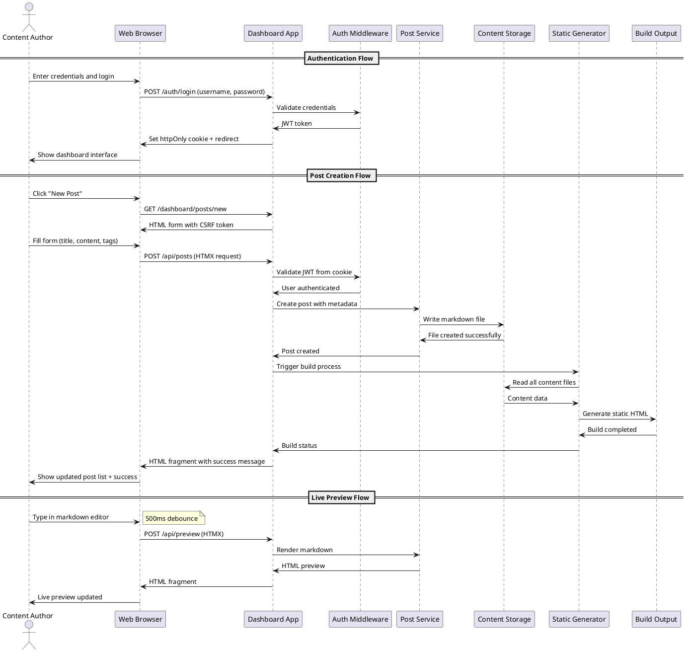

# Task Briefing Package

This package contains all necessary information and strategic guidance for the Coder Agent.

---

## 1. Current Task Details

This is the full specification of the task you must complete.

```json
{
  "task_id": "I5.T8",
  "iteration_id": "I5",
  "iteration_goal": "Implement HTMX-enhanced interactivity, live markdown preview, image management, and build system integration with the dashboard",
  "description": "Create end-to-end tests for complete user workflows including authentication, post creation with images, live preview, publishing, and build processes.",
  "agent_type_hint": "TestingAgent",
  "inputs": "Complete user workflows, E2E testing requirements, HTMX interaction testing",
  "target_files": [
    "tests/e2e/test_complete_workflows.py",
    "tests/e2e/test_htmx_interactions.py"
  ],
  "input_files": [
    "microblog/server/app.py",
    "microblog/server/routes/api.py",
    "tests/conftest.py"
  ],
  "deliverables": "End-to-end test suite covering complete user workflows and HTMX functionality",
  "acceptance_criteria": "Complete user journeys tested, HTMX interactions verified, image upload workflows tested, build process integration tested, test coverage comprehensive",
  "dependencies": [
    "I5.T6",
    "I5.T7"
  ],
  "parallelizable": true,
  "done": false
}
```

---

## 2. Architectural & Planning Context

The following are the relevant sections from the architecture and plan documents, which I found by analyzing the task description.

### Context: verification-and-integration-strategy (from 03_Verification_and_Glossary.md)

```markdown
## 5. Verification and Integration Strategy

*   **Testing Levels:**
    *   **Unit Testing**: Individual component testing with pytest, focusing on business logic, authentication, content processing, and build system components. Target coverage >85% for all modules with comprehensive edge case testing.
    *   **Integration Testing**: API endpoint testing, database interactions, file system operations, and service integration testing. Verify authentication flows, content management workflows, and build system integration.
    *   **End-to-End Testing**: Complete user workflow testing including authentication, post creation, editing, publishing, and build processes. Test HTMX interactions, form submissions, and dashboard functionality.
    *   **Performance Testing**: Build time validation (<5s for 100 posts, <30s for 1000 posts), API response time verification (<200ms), and load testing for concurrent dashboard users.
    *   **Security Testing**: Authentication security, CSRF protection, input validation, file upload security, and SQL injection prevention testing.

*   **CI/CD:**
    *   **Automated Testing**: All tests run on every commit with GitHub Actions or similar CI system
    *   **Code Quality Gates**: Ruff linting, type checking with mypy, security scanning with bandit
    *   **Build Validation**: Automated build testing with sample content, template rendering verification
    *   **Artifact Validation**: OpenAPI specification validation, PlantUML diagram syntax checking, configuration schema validation
    *   **Deployment Testing**: Docker image building, deployment script validation, service configuration testing

*   **Code Quality Gates:**
    *   **Linting Success**: All code must pass Ruff linting with zero errors and warnings
    *   **Type Coverage**: Minimum 90% type hint coverage with mypy validation
    *   **Test Coverage**: Minimum 85% code coverage across all modules
    *   **Security Scan**: Zero high-severity security vulnerabilities detected by bandit
    *   **Performance Benchmarks**: All performance targets met in automated testing
    *   **Documentation Coverage**: All public APIs and configuration options documented

*   **Artifact Validation:**
    *   **PlantUML Diagrams**: Syntax validation and rendering verification for all diagram files
    *   **OpenAPI Specification**: Schema validation and endpoint coverage verification
    *   **Configuration Schema**: JSON Schema validation and comprehensive setting coverage
    *   **Documentation Quality**: Spelling, grammar, and link validation for all documentation
    *   **Template Validation**: Jinja2 template syntax checking and rendering verification
    *   **Build Output Validation**: Generated HTML validation, link checking, and asset verification
```

### Context: key-interaction-flow (from 04_Behavior_and_Communication.md)

```markdown
**Key Interaction Flow (Sequence Diagram):**

**Description:** This diagram illustrates the complete workflow for user authentication and post creation, showing the interaction between the web browser, dashboard application, authentication system, and content storage.

**Diagram (PlantUML):**

```

### Context: htmx-integration (from 04_Behavior_and_Communication.md)

```markdown
**HTMX Integration Patterns:**

1. **Live Form Validation**
```html
<input name="title"
       hx-post="/api/validate/title"
       hx-trigger="blur"
       hx-target="#title-feedback">
```

2. **Dynamic Content Updates**
```html
<button hx-delete="/api/posts/123"
        hx-confirm="Delete this post?"
        hx-target="#post-123"
        hx-swap="outerHTML">Delete</button>
```

3. **Live Markdown Preview**
```html
<textarea name="content"
          hx-post="/api/preview"
          hx-trigger="keyup changed delay:500ms"
          hx-target="#preview-pane">
```

4. **Build Progress Updates**
```html
<button hx-post="/api/build"
        hx-target="#build-status"
        hx-indicator="#build-spinner">Rebuild Site</button>
```
```

### Context: api-endpoints-detail (from 04_Behavior_and_Communication.md)

```markdown
**Detailed API Endpoints:**

**Authentication Endpoints:**
```
POST /auth/login
Content-Type: application/x-www-form-urlencoded
Body: username=admin&password=secret&csrf_token=...
Response: 302 Redirect + Set-Cookie: jwt=...; HttpOnly; Secure; SameSite=Strict

POST /auth/logout
Response: 302 Redirect + Set-Cookie: jwt=; Expires=Thu, 01 Jan 1970 00:00:00 GMT
```

**Dashboard API Endpoints:**
```
GET /dashboard
Headers: Cookie: jwt=...
Response: 200 OK + HTML dashboard page

POST /api/posts
Headers: Cookie: jwt=...; X-CSRF-Token: ...
Content-Type: application/json
Body: {
  "title": "My New Post",
  "content": "# Hello World\nThis is my post content",
  "tags": ["tech", "blogging"],
  "draft": true
}
Response: 201 Created + HTML fragment with post data

PUT /api/posts/123
Headers: Cookie: jwt=...; X-CSRF-Token: ...
Content-Type: application/json
Body: { "title": "Updated Title", "content": "...", "draft": false }
Response: 200 OK + HTML fragment with updated post

DELETE /api/posts/123
Headers: Cookie: jwt=...; X-CSRF-Token: ...
Response: 200 OK + HTML fragment removing post from list

POST /api/build
Headers: Cookie: jwt=...; X-CSRF-Token: ...
Response: 202 Accepted + HTML fragment with build progress
```

**Image Upload Endpoint:**
```
POST /api/images
Headers: Cookie: jwt=...; X-CSRF-Token: ...
Content-Type: multipart/form-data
Body: file=@image.jpg
Response: 201 Created + JSON with image URL and markdown snippet
{
  "filename": "2025-10-26-image.jpg",
  "url": "../images/2025-10-26-image.jpg",
  "markdown": ""
}
```
```

---

## 3. Codebase Analysis & Strategic Guidance

The following analysis is based on my direct review of the current codebase. Use these notes and tips to guide your implementation.

### Relevant Existing Code
*   **File:** `tests/e2e/test_complete_workflows.py`
    *   **Summary:** This file contains comprehensive E2E tests for complete user workflows but appears to be partially implemented. It has substantial test coverage for authentication, post creation, editing, and publishing workflows.
    *   **Recommendation:** You SHOULD extend the existing test structure rather than rewriting. The current tests use good patterns with mocking and temporary directories. Focus on completing missing test scenarios and improving robustness.

*   **File:** `tests/e2e/test_htmx_interactions.py`
    *   **Summary:** This file contains HTMX-specific interaction tests including dynamic post operations, live preview, image uploads, and build processes. The test structure is well-designed with proper service mocking.
    *   **Recommendation:** You SHOULD build upon the existing HTMX test patterns. The tests already cover API endpoints, fragment validation, and authentication requirements. Enhance coverage for edge cases and error scenarios.

*   **File:** `tests/conftest.py`
    *   **Summary:** This file provides shared test fixtures including temporary directories, configuration data, and mock utilities for the test suite.
    *   **Recommendation:** You MUST reuse the existing fixtures for consistency. The `temp_config_file`, `valid_config_data`, and `temp_content_dir` fixtures are well-structured and should be used in your E2E tests.

*   **File:** `microblog/server/routes/api.py`
    *   **Summary:** This file contains the HTMX API endpoints that your E2E tests need to validate. It includes endpoints for posts, preview, images, and build processes with proper error handling.
    *   **Recommendation:** You SHOULD test all the API endpoints defined in this file. Pay special attention to the error fragment generation patterns and HTMX response formats.

*   **File:** `microblog/server/app.py`
    *   **Summary:** This file contains the FastAPI application factory with middleware configuration, route registration, and authentication setup.
    *   **Recommendation:** You MUST use the `create_app()` function in your E2E tests to ensure you're testing the complete application stack including middleware.

### Implementation Tips & Notes
*   **Tip:** The existing E2E tests already use a sophisticated mocking strategy with `patch()` decorators for service injection. You SHOULD follow the same pattern to isolate external dependencies while testing the complete workflow logic.

*   **Note:** Both E2E test files use `TestClient` from FastAPI for making HTTP requests. This is the correct approach for testing the complete request/response cycle including middleware processing.

*   **Warning:** The current E2E tests have some resilience built in for authentication failures and middleware issues. You SHOULD maintain this defensive testing approach, especially for authentication workflows that may fail due to configuration issues.

*   **Tip:** The tests use temporary directories for content storage which is excellent for isolation. You SHOULD extend the `temp_project_dir` fixture pattern to create more realistic test scenarios with actual files and directories.

*   **Note:** The HTMX tests validate HTML fragment responses and content types. You MUST ensure your new tests verify that API endpoints return proper HTML fragments with correct `hx-swap-oob` attributes for HTMX integration.

*   **Important:** The existing tests show good patterns for testing error scenarios, validation failures, and service unavailability. You SHOULD add more comprehensive error testing for edge cases like network failures, file system errors, and race conditions.

*   **Tip:** I noticed the tests mock image uploads using `BytesIO` and file-like objects. You SHOULD use this pattern for testing complete image upload workflows including validation, processing, and markdown snippet generation.

*   **Performance Note:** The test suite should validate that build processes complete within expected timeframes (< 5s for small content sets as per architecture requirements). You SHOULD add performance validation to build workflow tests.

*   **Security Note:** The tests properly validate authentication requirements for protected endpoints. You SHOULD ensure comprehensive coverage of unauthorized access scenarios and CSRF protection testing.