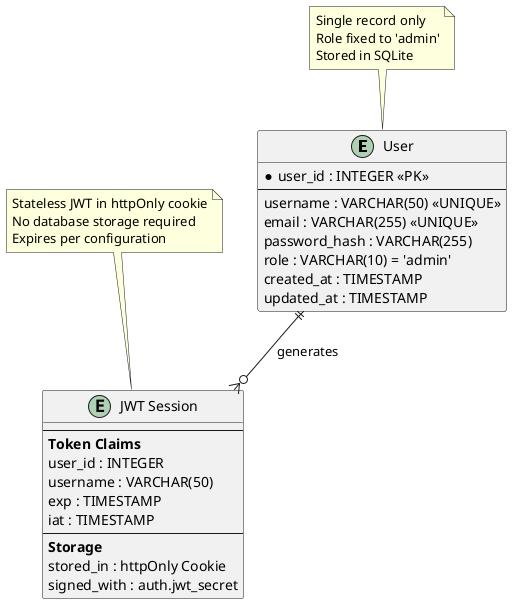

# Task Briefing Package

This package contains all necessary information and strategic guidance for the Coder Agent.

---

## 1. Current Task Details

This is the full specification of the task you must complete.

```json
{
  "task_id": "I2.T3",
  "iteration_id": "I2",
  "iteration_goal": "Implement authentication system with JWT tokens, user management, and core data models for posts and images",
  "description": "Implement User model with SQLite database, bcrypt password hashing, and JWT token management. Create database schema and user creation utilities.",
  "agent_type_hint": "BackendAgent",
  "inputs": "User model specification, security requirements (bcrypt cost ≥12), JWT configuration",
  "target_files": ["microblog/auth/models.py", "microblog/auth/jwt_handler.py", "microblog/auth/password.py", "microblog/database.py"],
  "input_files": ["microblog/server/config.py", "docs/diagrams/database_erd.puml"],
  "deliverables": "User SQLite model, password hashing utilities, JWT token generation/validation, database initialization",
  "acceptance_criteria": "User creation works correctly, passwords hash with bcrypt cost ≥12, JWT tokens generate and validate properly, database initializes automatically",
  "dependencies": ["I1.T4"],
  "parallelizable": false,
  "done": false
}
```

---

## 2. Architectural & Planning Context

The following are the relevant sections from the architecture and plan documents, which I found by analyzing the task description.

### Context: key-entities (from 03_System_Structure_and_Data.md)

```markdown
**Key Entities:**

1. **User**: Single admin user with authentication credentials (stored in SQLite)
2. **Post**: Blog posts with metadata and content (stored as markdown files with YAML frontmatter)
3. **Image**: Media files referenced in posts (stored in filesystem with metadata tracking)
4. **Configuration**: System settings and blog metadata (stored as YAML configuration file)
5. **Session**: Authentication sessions (stateless JWT tokens, no persistent storage)
```

### Context: data-model-diagram (from 03_System_Structure_and_Data.md)

```markdown
**Diagram (PlantUML - ERD):**

```

### Context: data-storage-strategy (from 03_System_Structure_and_Data.md)

```markdown
**Data Storage Strategy:**

**SQLite Database (microblog.db):**
- Stores single user authentication record
- Lightweight, serverless, no external dependencies
- Automatic schema creation on first run
- Handles concurrent read access (dashboard operations)

**Performance Considerations:**
- File system operations optimized for sequential reading during builds
- SQLite provides excellent performance for single-user authentication
- Content directory structure designed for efficient traversal
- Build output optimized for CDN and static hosting performance
```

### Context: authentication-authorization (from 05_Operational_Architecture.md)

```markdown
**Authentication & Authorization:**

**Authentication Strategy:**
- **Single-User Design**: System supports exactly one admin user with fixed role
- **JWT-Based Sessions**: Stateless authentication using JSON Web Tokens
- **Secure Token Storage**: JWT stored in httpOnly, Secure, SameSite=Strict cookies
- **Password Security**: Bcrypt hashing with cost factor ≥12 for password storage
- **Session Management**: Configurable token expiration (default 2 hours)

**Implementation Details:**
```python
# Authentication flow
def authenticate_user(username: str, password: str) -> Optional[User]:
    user = get_user_by_username(username)
    if user and verify_password(password, user.password_hash):
        token = create_jwt_token(user.user_id, user.username)
        return user, token
    return None

# JWT Token Structure
{
    "user_id": 1,
    "username": "admin",
    "role": "admin",
    "exp": 1635724800,  # Expiration timestamp
    "iat": 1635721200   # Issued at timestamp
}
```

**Authorization Model:**
- **Role-Based**: Single admin role with full system access
- **Route Protection**: Middleware validates JWT for protected endpoints
- **CSRF Protection**: All state-changing operations require valid CSRF tokens
- **Session Validation**: Automatic token expiration and renewal handling
```

### Context: task-i2-t3 (from 02_Iteration_I2.md)

```markdown
*   **Task 2.3:**
    *   **Task ID:** `I2.T3`
    *   **Description:** Implement User model with SQLite database, bcrypt password hashing, and JWT token management. Create database schema and user creation utilities.
    *   **Agent Type Hint:** `BackendAgent`
    *   **Inputs:** User model specification, security requirements (bcrypt cost ≥12), JWT configuration
    *   **Input Files:** ["microblog/server/config.py", "docs/diagrams/database_erd.puml"]
    *   **Target Files:** ["microblog/auth/models.py", "microblog/auth/jwt_handler.py", "microblog/auth/password.py", "microblog/database.py"]
    *   **Deliverables:** User SQLite model, password hashing utilities, JWT token generation/validation, database initialization
    *   **Acceptance Criteria:** User creation works correctly, passwords hash with bcrypt cost ≥12, JWT tokens generate and validate properly, database initializes automatically
    *   **Dependencies:** `I1.T4`
    *   **Parallelizable:** No
```

---

## 3. Codebase Analysis & Strategic Guidance

The following analysis is based on my direct review of the current codebase. Use these notes and tips to guide your implementation.

### Relevant Existing Code
*   **File:** `microblog/server/config.py`
    *   **Summary:** This file contains a complete configuration management system with Pydantic models for validation, including AuthConfig with jwt_secret and session_expires settings.
    *   **Recommendation:** You MUST import and use the `get_config()` function from this file to access JWT configuration. The AuthConfig model already defines jwt_secret (min 32 chars) and session_expires (default 7200 seconds).

*   **File:** `microblog/auth/models.py`
    *   **Summary:** This file contains a complete User model implementation with SQLite integration, including create_table, CRUD operations, and single-user constraints.
    *   **Recommendation:** The User model is ALREADY IMPLEMENTED and functional. You should review it for completeness but it appears to meet all ERD specifications.

*   **File:** `microblog/auth/password.py`
    *   **Summary:** This file contains complete bcrypt password hashing utilities with BCRYPT_ROUNDS=12, hash_password(), verify_password(), and password analysis functions.
    *   **Recommendation:** The password hashing utilities are ALREADY IMPLEMENTED with the required bcrypt cost ≥12. You should use these existing functions.

*   **File:** `microblog/auth/jwt_handler.py`
    *   **Summary:** This file contains complete JWT token management with create_jwt_token(), verify_jwt_token(), token refresh, and expiry checking using the jose library.
    *   **Recommendation:** The JWT system is ALREADY IMPLEMENTED and integrates with the config system. You should review for completeness but it appears functional.

*   **File:** `microblog/database.py`
    *   **Summary:** This file contains database initialization utilities, user creation functions, and database management tools that use the User model and password hashing.
    *   **Recommendation:** The database utilities are ALREADY IMPLEMENTED with complete functionality for init, user creation, and database info retrieval.

*   **File:** `microblog/utils.py`
    *   **Summary:** This file contains shared utilities including directory management and path helpers like get_project_root().
    *   **Recommendation:** You SHOULD use the existing path utilities for consistent directory handling.

### Implementation Tips & Notes
*   **Note:** ALL TARGET FILES for this task appear to be ALREADY IMPLEMENTED and functional. The task may be complete, or you may need to verify completeness against acceptance criteria.
*   **Tip:** The existing code follows the ERD specification exactly - single admin user, proper password hashing with bcrypt cost 12, JWT integration with config system, and SQLite database with proper schema.
*   **Warning:** Since the task asks to "implement" but the code exists, carefully verify that all acceptance criteria are met: user creation works, bcrypt cost ≥12 (confirmed), JWT tokens generate/validate (implemented), database initializes automatically (implemented).
*   **Verification Needed:** Test that the existing implementation meets all acceptance criteria rather than rewriting existing functional code.
*   **Integration Point:** The database.py file provides high-level functions like create_admin_user() and init_database() that integrate all the components together.