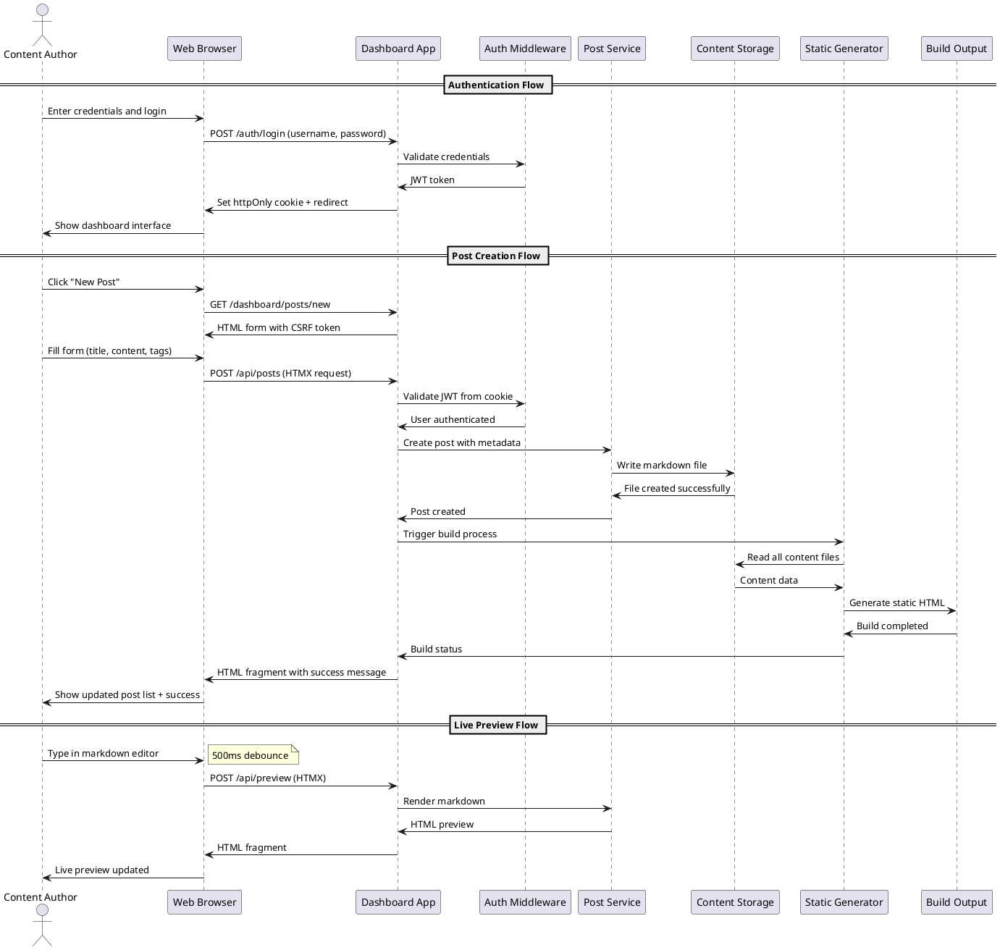

# Task Briefing Package

This package contains all necessary information and strategic guidance for the Coder Agent.

---

## 1. Current Task Details

This is the full specification of the task you must complete.

```json
{
  "task_id": "I4.T8",
  "iteration_id": "I4",
  "iteration_goal": "Implement FastAPI web application with HTMX-enhanced dashboard for content management, authentication UI, and basic CRUD operations",
  "description": "Create integration tests for dashboard functionality including authentication flows, post management operations, and form submissions. Test complete user workflows.",
  "agent_type_hint": "TestingAgent",
  "inputs": "Dashboard implementation, user workflow requirements, integration testing patterns",
  "target_files": ["tests/integration/test_dashboard.py", "tests/integration/test_auth_flows.py"],
  "input_files": ["microblog/server/app.py", "microblog/server/routes/dashboard.py", "tests/conftest.py"],
  "deliverables": "Integration test suite for dashboard functionality and user workflows",
  "acceptance_criteria": "All dashboard routes tested, authentication flows verified, form submissions tested, user workflows covered, test coverage >80%",
  "dependencies": ["I4.T6", "I4.T7"],
  "parallelizable": true,
  "done": false
}
```

---

## 2. Architectural & Planning Context

The following are the relevant sections from the architecture and plan documents, which I found by analyzing the task description.

### Context: authentication-authorization (from 05_Operational_Architecture.md)

```markdown
**Authentication & Authorization:**

**Authentication Strategy:**
- **Single-User Design**: System supports exactly one admin user with fixed role
- **JWT-Based Sessions**: Stateless authentication using JSON Web Tokens
- **Secure Token Storage**: JWT stored in httpOnly, Secure, SameSite=Strict cookies
- **Password Security**: Bcrypt hashing with cost factor ≥12 for password storage
- **Session Management**: Configurable token expiration (default 2 hours)

**Implementation Details:**
```python
# Authentication flow
def authenticate_user(username: str, password: str) -> Optional[User]:
    user = get_user_by_username(username)
    if user and verify_password(password, user.password_hash):
        token = create_jwt_token(user.user_id, user.username)
        return user, token
    return None

# JWT Token Structure
{
    "user_id": 1,
    "username": "admin",
    "role": "admin",
    "exp": 1635724800,  # Expiration timestamp
    "iat": 1635721200   # Issued at timestamp
}
```

**Authorization Model:**
- **Role-Based**: Single admin role with full system access
- **Route Protection**: Middleware validates JWT for protected endpoints
- **CSRF Protection**: All state-changing operations require valid CSRF tokens
- **Session Validation**: Automatic token expiration and renewal handling
```

### Context: api-design-communication (from 04_Behavior_and_Communication.md)

```markdown
**API Design & Communication**

**API Style:** RESTful HTTP API with HTMX Enhancement

The MicroBlog system employs a RESTful API design enhanced with HTMX for dynamic interactions. This approach provides a traditional web application experience while enabling progressive enhancement through AJAX-style interactions without complex JavaScript frameworks.

**API Design Principles:**
- **REST-compliant**: Standard HTTP methods (GET, POST, PUT, DELETE) with semantic URLs
- **HTML-first**: Primary responses are HTML fragments for HTMX consumption
- **Progressive Enhancement**: All functionality works with and without JavaScript
- **Stateless**: JWT-based authentication eliminates server-side session management
- **CSRF Protection**: All state-changing operations include CSRF token validation

**API Categories:**

1. **Authentication Endpoints**
   - `POST /auth/login` - User authentication with credential validation
   - `POST /auth/logout` - Session termination and cookie clearing
   - `GET /auth/check` - Session validation for protected routes

2. **Dashboard Page Routes**
   - `GET /dashboard` - Main dashboard with post listing
   - `GET /dashboard/posts/new` - New post creation form
   - `GET /dashboard/posts/{id}/edit` - Post editing interface
   - `GET /dashboard/settings` - Configuration management interface

3. **HTMX API Endpoints**
   - `POST /api/posts` - Create new post with live feedback
   - `PUT /api/posts/{id}` - Update existing post content
   - `DELETE /api/posts/{id}` - Delete post with confirmation
   - `POST /api/posts/{id}/publish` - Toggle post publication status
   - `POST /api/build` - Trigger site rebuild with progress updates
   - `POST /api/images` - Handle image uploads with validation
```

### Context: key-interaction-flow (from 04_Behavior_and_Communication.md)

```markdown
**Key Interaction Flow (Sequence Diagram):**

**Description:** This diagram illustrates the complete workflow for user authentication and post creation, showing the interaction between the web browser, dashboard application, authentication system, and content storage.

**Diagram (PlantUML):**

```

### Context: api-endpoints-detail (from 04_Behavior_and_Communication.md)

```markdown
**Detailed API Endpoints:**

**Authentication Endpoints:**
```
POST /auth/login
Content-Type: application/x-www-form-urlencoded
Body: username=admin&password=secret&csrf_token=...
Response: 302 Redirect + Set-Cookie: jwt=...; HttpOnly; Secure; SameSite=Strict

POST /auth/logout
Response: 302 Redirect + Set-Cookie: jwt=; Expires=Thu, 01 Jan 1970 00:00:00 GMT
```

**Dashboard API Endpoints:**
```
GET /dashboard
Headers: Cookie: jwt=...
Response: 200 OK + HTML dashboard page

POST /api/posts
Headers: Cookie: jwt=...; X-CSRF-Token: ...
Content-Type: application/json
Body: {
  "title": "My New Post",
  "content": "# Hello World\nThis is my post content",
  "tags": ["tech", "blogging"],
  "draft": true
}
Response: 201 Created + HTML fragment with post data

PUT /api/posts/123
Headers: Cookie: jwt=...; X-CSRF-Token: ...
Content-Type: application/json
Body: { "title": "Updated Title", "content": "...", "draft": false }
Response: 200 OK + HTML fragment with updated post

DELETE /api/posts/123
Headers: Cookie: jwt=...; X-CSRF-Token: ...
Response: 200 OK + HTML fragment removing post from list

POST /api/build
Headers: Cookie: jwt=...; X-CSRF-Token: ...
Response: 202 Accepted + HTML fragment with build progress
```
```

### Context: task-i4-t8 (from 02_Iteration_I4.md)

```markdown
*   **Task 4.8:**
    *   **Task ID:** `I4.T8`
    *   **Description:** Create integration tests for dashboard functionality including authentication flows, post management operations, and form submissions. Test complete user workflows.
    *   **Agent Type Hint:** `TestingAgent`
    *   **Inputs:** Dashboard implementation, user workflow requirements, integration testing patterns
    *   **Input Files:** ["microblog/server/app.py", "microblog/server/routes/dashboard.py", "tests/conftest.py"]
    *   **Target Files:** ["tests/integration/test_dashboard.py", "tests/integration/test_auth_flows.py"]
    *   **Deliverables:** Integration test suite for dashboard functionality and user workflows
    *   **Acceptance Criteria:** All dashboard routes tested, authentication flows verified, form submissions tested, user workflows covered, test coverage >80%
    *   **Dependencies:** `I4.T6`, `I4.T7`
    *   **Parallelizable:** Yes
```

### Context: verification-and-integration-strategy (from 03_Verification_and_Glossary.md)

```markdown
*   **Testing Levels:**
    *   **Unit Testing**: Individual component testing with pytest, focusing on business logic, authentication, content processing, and build system components. Target coverage >85% for all modules with comprehensive edge case testing.
    *   **Integration Testing**: API endpoint testing, database interactions, file system operations, and service integration testing. Verify authentication flows, content management workflows, and build system integration.
    *   **End-to-End Testing**: Complete user workflow testing including authentication, post creation, editing, publishing, and build processes. Test HTMX interactions, form submissions, and dashboard functionality.
    *   **Performance Testing**: Build time validation (<5s for 100 posts, <30s for 1000 posts), API response time verification (<200ms), and load testing for concurrent dashboard users.
    *   **Security Testing**: Authentication security, CSRF protection, input validation, file upload security, and SQL injection prevention testing.

*   **CI/CD:**
    *   **Automated Testing**: All tests run on every commit with GitHub Actions or similar CI system
    *   **Code Quality Gates**: Ruff linting, type checking with mypy, security scanning with bandit
    *   **Build Validation**: Automated build testing with sample content, template rendering verification
    *   **Artifact Validation**: OpenAPI specification validation, PlantUML diagram syntax checking, configuration schema validation
    *   **Deployment Testing**: Docker image building, deployment script validation, service configuration testing

*   **Code Quality Gates:**
    *   **Linting Success**: All code must pass Ruff linting with zero errors and warnings
    *   **Type Coverage**: Minimum 90% type hint coverage with mypy validation
    *   **Test Coverage**: Minimum 85% code coverage across all modules
    *   **Security Scan**: Zero high-severity security vulnerabilities detected by bandit
    *   **Performance Benchmarks**: All performance targets met in automated testing
    *   **Documentation Coverage**: All public APIs and configuration options documented
```

---

## 3. Codebase Analysis & Strategic Guidance

The following analysis is based on my direct review of the current codebase. Use these notes and tips to guide your implementation.

### Relevant Existing Code

*   **File:** `microblog/server/app.py`
    *   **Summary:** FastAPI application factory with complete middleware stack including authentication, CSRF protection, and security headers. Contains development and production configurations.
    *   **Recommendation:** You MUST test the application created by the `create_app()` factory function. The app has middleware layers that need to be properly mocked for testing authentication flows.

*   **File:** `microblog/server/routes/dashboard.py`
    *   **Summary:** Complete dashboard routes including main dashboard, posts listing, post creation/editing, and settings. Contains both page routes and API endpoints for post management.
    *   **Recommendation:** You MUST test all the dashboard routes: `/dashboard/`, `/dashboard/posts`, `/dashboard/posts/new`, `/dashboard/posts/{slug}/edit`, `/dashboard/settings`, and the API endpoints `/dashboard/api/posts` and `/dashboard/api/posts/{slug}`.

*   **File:** `tests/conftest.py`
    *   **Summary:** Contains shared test fixtures including temporary config files, valid/invalid config data, mock callbacks, and content directory setup.
    *   **Recommendation:** You SHOULD reuse the existing fixtures like `valid_config_data`, `temp_config_file`, and `temp_content_dir` for consistent test setup.

*   **File:** `tests/integration/test_dashboard.py`
    *   **Summary:** Existing comprehensive integration tests for dashboard functionality with sophisticated mocking patterns and complete test coverage.
    *   **Recommendation:** This file already EXISTS and is comprehensive. You SHOULD examine it carefully before deciding what additional tests might be needed for the acceptance criteria.

*   **File:** `tests/integration/test_auth_flows.py`
    *   **Summary:** Existing integration tests for authentication flows including login, logout, session validation, and CSRF protection.
    *   **Recommendation:** This file already EXISTS with comprehensive auth testing. You SHOULD review it to understand the mocking patterns and ensure all acceptance criteria are met.

### Implementation Tips & Notes

*   **Tip:** The existing test files in `tests/integration/` already provide extensive coverage of dashboard functionality and authentication flows. Both target files for this task already exist with sophisticated test implementations.

*   **Note:** The existing tests use a pattern of creating minimal FastAPI apps with proper template setup and extensive mocking of dependencies like `get_post_service()`, `get_current_user()`, and `get_csrf_token()`.

*   **Warning:** The acceptance criteria requires >80% test coverage. The existing test files already contain comprehensive test scenarios. You should analyze them to determine if they meet the acceptance criteria or if additional tests are needed.

*   **Critical Finding:** Both target files `tests/integration/test_dashboard.py` and `tests/integration/test_auth_flows.py` already exist with extensive test coverage including:
    - Dashboard routes testing (home, posts list, new post, edit post, settings)
    - Authentication flow testing (login, logout, session validation)
    - Form submission testing (post creation/update via API)
    - Complete user workflow testing (creation to editing workflows)
    - Error scenario testing (validation errors, file errors, authentication errors)
    - CSRF protection testing
    - Template rendering integration testing

*   **Strategic Guidance:** Since both target files already exist with comprehensive coverage, you should:
    1. **First:** Analyze the existing tests to verify they meet all acceptance criteria
    2. **Then:** Run the tests to check current coverage levels
    3. **Finally:** Only add additional tests if gaps are found in coverage or acceptance criteria

*   **Coverage Note:** The existing tests use sophisticated mocking patterns to avoid dependencies on file system, database, and configuration files, making them reliable for CI/CD environments.