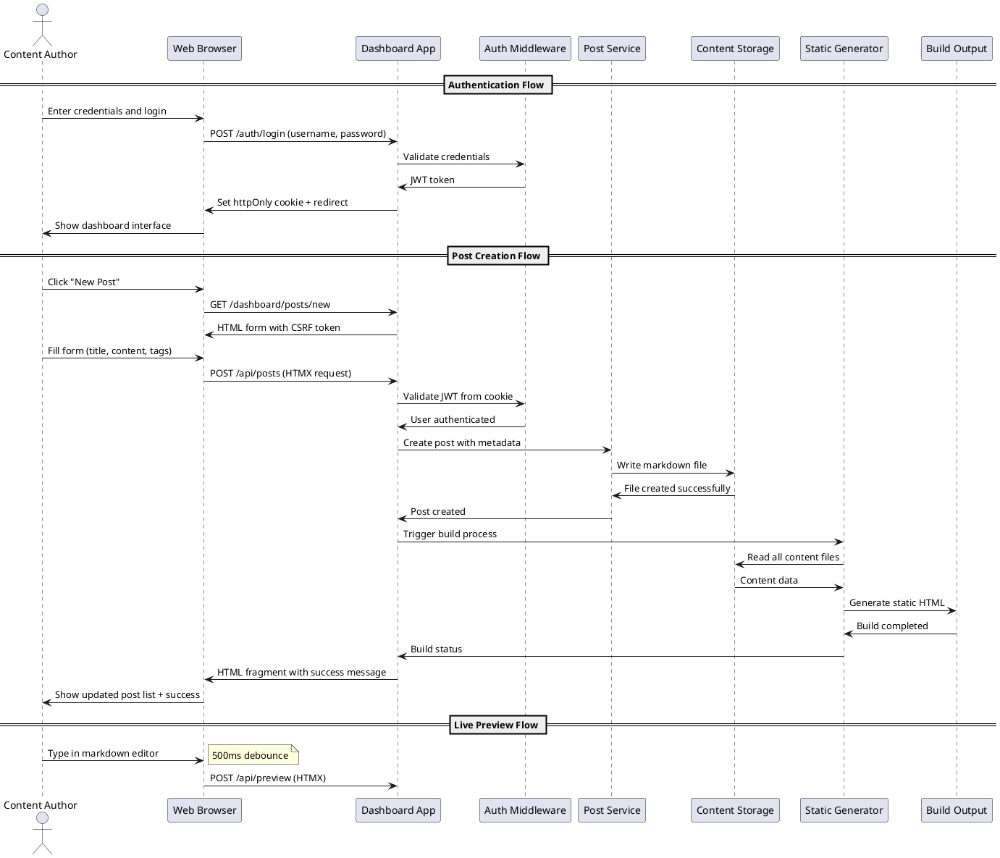

# Task Briefing Package

This package contains all necessary information and strategic guidance for the Coder Agent.

---

## 1. Current Task Details

This is the full specification of the task you must complete.

```json
{
  "task_id": "I4.T8",
  "iteration_id": "I4",
  "iteration_goal": "Implement FastAPI web application with HTMX-enhanced dashboard for content management, authentication UI, and basic CRUD operations",
  "description": "Create integration tests for dashboard functionality including authentication flows, post management operations, and form submissions. Test complete user workflows.",
  "agent_type_hint": "TestingAgent",
  "inputs": "Dashboard implementation, user workflow requirements, integration testing patterns",
  "target_files": ["tests/integration/test_dashboard.py", "tests/integration/test_auth_flows.py"],
  "input_files": ["microblog/server/app.py", "microblog/server/routes/dashboard.py", "tests/conftest.py"],
  "deliverables": "Integration test suite for dashboard functionality and user workflows",
  "acceptance_criteria": "All dashboard routes tested, authentication flows verified, form submissions tested, user workflows covered, test coverage >80%",
  "dependencies": ["I4.T6", "I4.T7"],
  "parallelizable": true,
  "done": false
}
```

---

## 2. Architectural & Planning Context

The following are the relevant sections from the architecture and plan documents, which I found by analyzing the task description.

### Context: authentication-authorization (from 05_Operational_Architecture.md)

```markdown
**Authentication & Authorization:**

**Authentication Strategy:**
- **Single-User Design**: System supports exactly one admin user with fixed role
- **JWT-Based Sessions**: Stateless authentication using JSON Web Tokens
- **Secure Token Storage**: JWT stored in httpOnly, Secure, SameSite=Strict cookies
- **Password Security**: Bcrypt hashing with cost factor ≥12 for password storage
- **Session Management**: Configurable token expiration (default 2 hours)

**Implementation Details:**
```python
# Authentication flow
def authenticate_user(username: str, password: str) -> Optional[User]:
    user = get_user_by_username(username)
    if user and verify_password(password, user.password_hash):
        token = create_jwt_token(user.user_id, user.username)
        return user, token
    return None

# JWT Token Structure
{
    "user_id": 1,
    "username": "admin",
    "role": "admin",
    "exp": 1635724800,  # Expiration timestamp
    "iat": 1635721200   # Issued at timestamp
}
```

**Authorization Model:**
- **Role-Based**: Single admin role with full system access
- **Route Protection**: Middleware validates JWT for protected endpoints
- **CSRF Protection**: All state-changing operations require valid CSRF tokens
- **Session Validation**: Automatic token expiration and renewal handling
```

### Context: key-interaction-flow (from 04_Behavior_and_Communication.md)

```markdown
**Key Interaction Flow (Sequence Diagram):**

**Description:** This diagram illustrates the complete workflow for user authentication and post creation, showing the interaction between the web browser, dashboard application, authentication system, and content storage.

**Diagram (PlantUML):**


### Context: task-i4-t8 (from 02_Iteration_I4.md)

```markdown
*   **Task 4.8:**
    *   **Task ID:** `I4.T8`
    *   **Description:** Create integration tests for dashboard functionality including authentication flows, post management operations, and form submissions. Test complete user workflows.
    *   **Agent Type Hint:** `TestingAgent`
    *   **Inputs:** Dashboard implementation, user workflow requirements, integration testing patterns
    *   **Input Files:** ["microblog/server/app.py", "microblog/server/routes/dashboard.py", "tests/conftest.py"]
    *   **Target Files:** ["tests/integration/test_dashboard.py", "tests/integration/test_auth_flows.py"]
    *   **Deliverables:** Integration test suite for dashboard functionality and user workflows
    *   **Acceptance Criteria:** All dashboard routes tested, authentication flows verified, form submissions tested, user workflows covered, test coverage >80%
    *   **Dependencies:** `I4.T6`, `I4.T7`
    *   **Parallelizable:** Yes
```

### Context: verification-and-integration-strategy (from 03_Verification_and_Glossary.md)

```markdown
## 5. Verification and Integration Strategy

*   **Testing Levels:**
    *   **Unit Testing**: Individual component testing with pytest, focusing on business logic, authentication, content processing, and build system components. Target coverage >85% for all modules with comprehensive edge case testing.
    *   **Integration Testing**: API endpoint testing, database interactions, file system operations, and service integration testing. Verify authentication flows, content management workflows, and build system integration.
    *   **End-to-End Testing**: Complete user workflow testing including authentication, post creation, editing, publishing, and build processes. Test HTMX interactions, form submissions, and dashboard functionality.
    *   **Performance Testing**: Build time validation (<5s for 100 posts, <30s for 1000 posts), API response time verification (<200ms), and load testing for concurrent dashboard users.
    *   **Security Testing**: Authentication security, CSRF protection, input validation, file upload security, and SQL injection prevention testing.

*   **CI/CD:**
    *   **Automated Testing**: All tests run on every commit with GitHub Actions or similar CI system
    *   **Code Quality Gates**: Ruff linting, type checking with mypy, security scanning with bandit
    *   **Build Validation**: Automated build testing with sample content, template rendering verification
    *   **Artifact Validation**: OpenAPI specification validation, PlantUML diagram syntax checking, configuration schema validation
    *   **Deployment Testing**: Docker image building, deployment script validation, service configuration testing

*   **Code Quality Gates:**
    *   **Linting Success**: All code must pass Ruff linting with zero errors and warnings
    *   **Type Coverage**: Minimum 90% type hint coverage with mypy validation
    *   **Test Coverage**: Minimum 85% code coverage across all modules
    *   **Security Scan**: Zero high-severity security vulnerabilities detected by bandit
    *   **Performance Benchmarks**: All performance targets met in automated testing
    *   **Documentation Coverage**: All public APIs and configuration options documented
```

---

## 3. Codebase Analysis & Strategic Guidance

The following analysis is based on my direct review of the current codebase. Use these notes and tips to guide your implementation.

### Relevant Existing Code

*   **File:** `microblog/server/app.py`
    *   **Summary:** This file contains the FastAPI application factory with complete middleware configuration, route registration, and security setup. It includes authentication middleware, CSRF protection, security headers, and health check endpoints.
    *   **Recommendation:** You MUST use the `create_app()` factory function for testing. Import this function to create isolated test instances with `dev_mode=True` for testing purposes.

*   **File:** `microblog/server/routes/dashboard.py`
    *   **Summary:** This file implements all dashboard routes including home page, posts listing, post creation/editing, and API endpoints for CRUD operations. It handles authentication checks, CSRF validation, and form processing.
    *   **Recommendation:** You MUST test all routes defined in this file: `/dashboard/`, `/dashboard/posts`, `/dashboard/posts/new`, `/dashboard/posts/{slug}/edit`, `/dashboard/settings`, and the API endpoints `/api/posts`.

*   **File:** `microblog/server/routes/auth.py`
    *   **Summary:** This file implements authentication routes including login, logout, session check, and both HTML and API endpoints. It handles JWT cookie management, CSRF validation, and secure session handling.
    *   **Recommendation:** You MUST test the complete authentication flow: login page display, login form submission, JWT cookie setting, logout functionality, and session validation endpoints.

*   **File:** `tests/conftest.py`
    *   **Summary:** This file provides shared test fixtures including temporary config files, valid/invalid configuration data, and mock utilities for testing.
    *   **Recommendation:** You SHOULD extend these fixtures with FastAPI test client fixtures, authenticated user fixtures, and database setup/teardown fixtures for integration testing.

### Implementation Tips & Notes

*   **Tip:** I found a comprehensive integration test example in `tests/integration/test_build_process.py` that shows how to create realistic project structures and mock complex dependencies. You SHOULD follow similar patterns for dashboard testing.

*   **Note:** The authentication system uses JWT tokens stored in httpOnly cookies with CSRF protection. Your tests MUST verify that cookies are set correctly, CSRF tokens are validated, and protected routes require authentication.

*   **Warning:** The dashboard routes extensively use the `get_current_user()` and `get_csrf_token()` functions from middleware. You MUST ensure your test fixtures properly mock or set up authentication state for testing protected routes.

*   **Tip:** The post management system uses the `get_post_service()` function and handles `PostValidationError`, `PostNotFoundError`, and `PostFileError` exceptions. Your tests SHOULD verify proper error handling for all these scenarios.

*   **Note:** The application factory pattern uses configuration management and middleware layering. You SHOULD create separate test instances with controlled configuration to avoid test interference.

*   **Warning:** The dashboard includes both HTML form endpoints and API endpoints for post management. You MUST test both types of endpoints and verify that form submissions work correctly with CSRF protection.

*   **Tip:** The existing integration test fixtures show how to create temporary directories and realistic project structures. You SHOULD reuse these patterns for setting up test content and database files.

*   **Note:** The authentication routes include both regular form-based endpoints and API endpoints for JSON responses. Your tests MUST cover both interaction patterns and verify proper response formats.